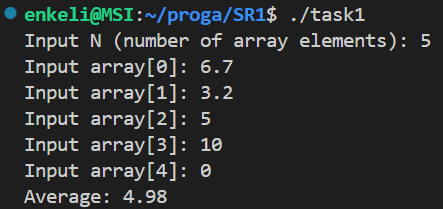
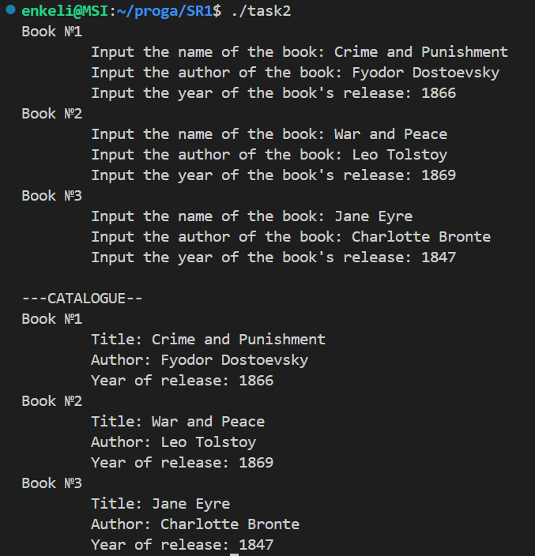
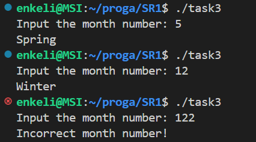

# 1. Самостоятельная работа №1

## Задача 1. Динамический массив и вычисление среднего арифметического

### 1.2 Постановка задачи

Напишите программу на языке Си, которая:
- Запрашивает у пользователя количество элементов массива (целое число `N`).
- Динамически выделяет память для массива из `N` элементов типа `float`.
- Заполняет массив значениями, введёнными с клавиатуры.
- Вычисляет и выводит среднее арифметическое всех элементов массива.
- При обращении к элементам массива используйте арифметику указателей (без оператора `[]`).
- Освобождает выделенную память в конце работы программы. 
*Подсказка*: Для обхода массива применяйте операции над указателем, например, увеличивая его значение на 1 для перехода к следующему элементу.

### 1.3 Математическая модель

$$
avg = sum / N
$$

### 1.4 Список идентификаторов

| Имя переменной | Тип данных | Описание                                                      |
| :------------: | :--------: | ------------------------------------------------------------- |
|      `N`       |   `int`    | Количество элементов в массиве                                |
|    `array`     |  `float*`  | Указатель на динамически выделенный массив чисел типа `float` |
|     `sum`      |  `float`   | Сумма элементов массива                                       |
|     `avg`      |  `float`   | Среднее арифметическое элементов массива                      |
|      `i`       |   `int`    | Параметр цикла для перебора элементов массива                 |

### 1.5 Код программы

```c
#include <stdio.h>
#include <stdlib.h>

int main(void) {
    int N;
    printf("Input N (number of array elements): ");
    scanf("%d", &N);
    float *array = malloc(N * sizeof(float));   // динамически выделяем память под N элементов типа float
    if (array == NULL) {    // проверка успешного выделения памяти
        printf("Memory allocation error!\n");
        return EXIT_FAILURE;
    }

    float sum = 0;
    for (int i = 0; i < N; i++) {
        printf("Input array[%d]: ", i); // считываем i-й элемент массива с клавиатуры
        scanf("%f", array + i);         // записываем его по адресу array+i
        sum += *(array + i);            // сразу же считаем сумму элементов
    }
    
    float avg = sum / N;
    printf("Average: %.2f\n", avg);
    free(array);    // освобождение динамической памяти, выделенной с помощью malloc()
    return EXIT_SUCCESS;
}
```

### 1.6 Результаты работы



## Задача 2. Каталог книг

### 2.2 Постановка задачи

Создайте структуру `Book`, которая содержит следующие поля:
* `title` – массив символов (строка) для хранения названия книги (максимум 50 символов);
* `author` – массив символов для хранения имени автора (максимум 50 символов);
* `year` – целое число, обозначающее год издания книги. 
Напишите программу, которая:
* Создаёт массив из 3-х экземпляров структуры `Book`.
* Запрашивает у пользователя данные для каждой книги (название, автора и год издания).
* Выводит информацию обо всех книгах на экран, используя для этого отдельную функцию `printBook()`, которая принимает указатель на структуру `Book`. 
*Подсказка*: Используйте функцию `fgets()` для ввода строк и `printf()` для форматированного вывода.

### 2.3 Математическая модель

$$-$$

### 2.4 Список идентификаторов

| Идентификатор | Тип данных         | Описание                                     |
| :-----------: | :----------------: | -------------------------------------------- |
| `MAX_LENGTH`  | `#define` макрос   | Максимальная длина строковых полей           |
| `N`           | `#define` макрос   | Количество книг в каталоге                   |
| `Book`        | `struct`           | Структура для хранения информации о книге    |
| `title`       | `char[MAX_LENGTH]` | Поле структуры: название книги               |
| `author`      | `char[MAX_LENGTH]` | Поле структуры: автор книги                  |
| `year`        | `int`              | Поле структуры: год выпуска книги            |
| `printBooks`  | `void`             | Функция для вывода каталога книг             |
| `books`       | `struct Book[N]`   | Массив экземпляров структуры `Book`          |
| `i`           | `int`              | Параметр цикла для перебора книг в массиве   |
| `n`           | `int`              | Параметр функции: количество книг для вывода |

### 2.5 Код программы

```c
#include <stdio.h>
#include <stdlib.h>
#define MAX_LENGTH 50
#define N 3

struct Book
{
    char title[MAX_LENGTH];
    char author[MAX_LENGTH];
    int year;
};

// передаем в функцию указатель на массив структур Book и количество книг в этом массиве
void printBooks(struct Book *books, int n) {
    printf("\n---CATALOGUE--\n");
    for (int i = 0; i < n; i++) {
        printf("Book №%d\n", i + 1);
        printf("\tTitle: %s", books[i].title);      // обращаемся сначала к конкретной книге по порядковому номеру в массиве,
        printf("\tAuthor: %s", books[i].author);    // а затем через точку к полю структуры Book
        // после вывода названия и автора перенос строки "\n" писать не нужно, 
        //так как fgets() уже считал его при вводе названия и автора
        printf("\tYear of release: %d\n", books[i].year);
    }
}

int main(void) {
    struct Book books[N];
    for (int i = 0; i < N; i++) {
        printf("Book №%d\n", i + 1);
        printf("\tInput the name of the book: ");
        fgets(books[i].title, MAX_LENGTH, stdin);
        // fgets() принимает строку, в которую будет записывать, длину этой строки
        // и источник ввода (в данном случае стандартный поток ввода)

        printf("\tInput the author of the book: ");
        fgets(books[i].author, MAX_LENGTH, stdin);

        printf("\tInput the year of the book's release: ");
        scanf("%d", &books[i].year);
        while (getchar() != '\n');
        // очищаем буфер ввода от оставшегося в нем '\n',
        // чтобы следующий fgets() не считал пустую строку
    }
    
    printBooks(books, N);

    return EXIT_SUCCESS;
}

```

### 2.6 Результаты работы



## Задача 3. Определение сезона по номеру месяца

### 3.2 Постановка задачи

Создайте перечисление Season со следующими значениями:
- `WINTER`, `SPRING`, `SUMMER`, `AUTUMN` 
Напишите программу, которая:
- Запрашивает у пользователя номер месяца (целое число от 1 до 12).
- На основе введённого номера месяца определяет и выводит соответствующий сезон:
    - Зима: декабрь (12), январь (1) и февраль (2);
    - Весна: март (3), апрель (4) и май (5);
    - Лето: июнь (6), июль (7) и август (8);
    - Осень: сентябрь (9), октябрь (10) и ноябрь (11).
- Для определения сезона можно использовать условные операторы (`if-else`) или конструкцию `switch`. 
*Подсказка*: Можно создать массив строк с названиями сезонов, индексируя его значением перечисления, или использовать `switch-case` для соответствия номера месяца и сезона.

### 3.3 Математическая модель

$$-$$

### 3.4 Список идентификаторов

| Идентификатор  | Тип данных       | Описание |
|---------------|------------------|----------|
| `Season`      | `enum`           | Перечисление времён года (WINTER, SPRING, SUMMER, AUTUMN) |
| `month`       | `int`            | Введённый пользователем номер месяца (1-12) |
| `season`      | `enum Season`    | Переменная для хранения текущего сезона |

### 3.5 Код программы

```c
#include <stdio.h>
#include <stdlib.h>

// Создаем перечисление Season с временами года
enum Season {
    WINTER, SPRING, SUMMER, AUTUMN
};

int main(void) {
    int month;
    printf("Input the month number: ");
    scanf("%d", &month);

    enum Season season; // объявляем переменную season типа перечисления Season
                        // она может принимать только одно из четырех значений, перечисленных в Season
    switch (month)
    {
    case 12:    // сквозное выполнение, так как несколько случаев обрабатываются одинаково
    case 1:
    case 2:
        season = WINTER; break;
    case 3:
    case 4:
    case 5:
        season = SPRING; break;
    case 6:
    case 7:
    case 8:
        season = SUMMER; break;
    case 9:
    case 10:
    case 11:
        season = AUTUMN; break;
    default:    // обработка неправильно введенного номера месяца
        printf("Incorrect month number!\n");
        return EXIT_FAILURE;
    }

    switch (season) {
        case WINTER: printf("Winter\n"); break;
        case SPRING: printf("Spring\n"); break;
        case SUMMER: printf("Summer\n"); break;
        case AUTUMN: printf("Autumn\n"); break;
    }

    return EXIT_SUCCESS;
}
```

### 3.6 Результаты работы



# 7. Трофимцова Екатерина, 1 курс, группа ИВТ-1, подгруппа 2