# 1. Задачи на автомат

*Все файлы с кодом также прикреплены в этом репозитории.*

## Задача 1. Проверка сбалансированности скобок в выражении

### 1.2 Постановка задачи

Напишите программу для проверки корректности расстановки круглых, фигурных и квадратных скобок в заданной строке. 
- **Вход.** Строка с выражением, содержащим скобки (может включать и другие символы). 
- **Выход.** Вывести `YES`, если все типы скобок в строке корректно сбалансированы, или `NO` – если допущена ошибка в порядке скобок. 
- **Требования.** Для проверки использовать стек. Алгоритм должен учитывать соответствие типов скобок (например, \[ соответствует \]) и их порядок вложенности. Программа игнорирует несвязанные символы и анализирует только скобки. При обнаружении несбалансированной скобочной структуры обработать ситуацию и вывести `NO`. Использование стека должно быть реализовано вручную (например, через массив или связный список), без использования сторонних коллекций.

### 1.3 Математическая модель

нет

### 1.4 Список идентификаторов

#### Макросы

|   **Имя**    |          **Тип**           | **Описание**                        |
| :----------: | :------------------------: | ----------------------------------- |
| `MAX_SIZE`   |   `#define` (макрос)       | Максимальный размер входной строки |

#### Структуры и поля

| **Имя** |     **Тип**      | **Описание**                               |
| :-----: | :--------------: | ------------------------------------------ |
| `Stack` | `typedef struct` | Структура стека                            |
| `data`  |     `char*`      | Массив, в котором хранятся элементы стека  |
|  `top`  |      `int`       | Индекс вершины стека (последнего элемента) |

#### Функции

|  **Имя**  |        **Тип**         | **Описание**                                   |
| :-------: | :--------------------: | ---------------------------------------------- |
|  `init`   | `void(Stack*, size_t)` | Инициализирует стек                            |
| `isEmpty` |     `bool(Stack*)`     | Проверяет, пуст ли стек                        |
|  `push`   |  `bool(Stack*, char)`  | Добавляет элемент в стек                       |
|   `pop`   | `bool(Stack*, char*)`  | Удаляет элемент из стека                       |
|  `peek`   | `bool(Stack*, char*)`  | Просматривает вершину стека, не удаляя элемент |
|  `main`   |      `int(void)`       | Главная функция программы                      |

#### Переменные в `main`

| **Имя**  |     **Тип**      | **Описание**                                            |
| :------: | :--------------: | ------------------------------------------------------- |
| `buffer` | `char[MAX_SIZE]` | Вводимая строка                                         |
|  `len`   |     `size_t`     | Длина строки                                            |
| `stack`  |     `Stack`      | Стек для хранения открывающихся скобок                  |
| `value`  |      `char`      | Переменная для хранения элемента, извлеченного из стека |
|   `i`    |      `int`       | Параметр цикла, индекс при проходе по строке            |

### 1.5 Код программы

```c
#include <stdio.h>
#include <stdbool.h>
#include <stdlib.h>
#include <string.h>
#define MAX_SIZE 1000

typedef struct Stack {
    char *data;    // Указатель на массив для хранения скобок
    int top;       // Индекс вершины стека (последнего добавленного элемента)
} Stack;

void init(Stack *s, size_t len);    // Функция инициализации стека
bool isEmpty(Stack *s);             // Функция проверки стека на пустоту
bool push(Stack *s, char value);    // Функция добавления элемента в стек
bool pop(Stack *s, char *value);    // Функция удаления элемента из стека
bool peek(Stack *s, char *value);   // Функция получения значения на вершине стека

int main() {
    char buffer[MAX_SIZE];                  // Буфер для хранения входной строки
    fgets(buffer, MAX_SIZE, stdin);         // Считываем входную строку и сохраняем ее в buffer
    size_t len = strlen(buffer);            // Получаем длину входной строки
    
    if (len > 0 && buffer[len-1] == '\n') {
        buffer[len - 1] = '\0';     // Удаляем символ новой строки, если он есть
        len--;                      // Корректируем длину строки
    }

    Stack stack;
    init(&stack, len);  // Инициализируем стек

    for (int i = 0; buffer[i] != '\0'; i++) {
        // Если это открывающая скобка, то добавляем ее в стек
        if (buffer[i] == '(' || buffer[i] == '[' || buffer[i] == '{') {
            push(&stack, buffer[i]);
        } 
        // Если скобка закрывающая:
        else if (buffer[i] == ')' || buffer[i] == ']' || buffer[i] == '}') {
            char value;
            // Получаем элемент на вершине стека
            if (!peek(&stack, &value)) {
                // Стек пуст - значит закрывающая скобка без пары - ошибка
                printf("NO\n");
                return EXIT_SUCCESS;
            }
            // Удаляем соответствующую открывающую скобку из стека
            // Иначе возвращаем "NO"
            switch (buffer[i]) {
            case ')':
                if (value == '(') {
                    pop(&stack, &value);
                }
                else {
                    printf("NO\n");
                    return EXIT_SUCCESS;
                }
                break;
            case ']':
                if (value == '[') {
                    pop(&stack, &value);
                }
                else {
                    printf("NO\n");
                    return EXIT_SUCCESS;
                }
                break;
            case '}':
                if (value == '{') {
                    pop(&stack, &value);
                }
                else {
                    printf("NO\n");
                    return EXIT_SUCCESS;
                }
                break;
            }
        }
    }

    // Если стек пуст - значит все скобки закрыты правильно
    if (isEmpty(&stack)) {
        printf("YES\n");
    } else {
        printf("NO\n");
    }
    free(stack.data);   // Освобождаем динамическую память, выделенную под стек

    return EXIT_SUCCESS;
}

// Функция инициализации стека
void init(Stack *s, size_t len) {
    s->top = -1;    // Изначально стек пуст - присваиваем вершине стека значение -1
    s->data = malloc(len * sizeof(char)); // И динамически выделяем под стек память по размеру входной строки
    // Проверка на успешное выделение памяти
    if (s->data == NULL) {
        fprintf(stderr, "Memory allocation failed\n");
        exit(EXIT_FAILURE);
    }
}

// Функция проверки стека на пустоту
bool isEmpty(Stack *s) {
    return s->top == -1;
    // Проверяем, что индекс вершины стека -1
    // Если да - возвращается true
    // Если нет - false и значит стек не пуст
}

// Функция добавления элемента в стек
bool push(Stack *s, char value) {
    s->data[++(s->top)] = value;    // Увеличиваем индекс вершины стека на 1 и сохраняем значение
    return true;
}

// Функция удаления элемента из стека
bool pop(Stack *s, char *value) {
    if (isEmpty(s)) {               // Если стек пуст,
        printf("Stack is empty\n"); // то удаление элемента из стека не происходит
        return false;               // и функция возвращает false
    }
    *value = s->data[(s->top)--];   // Сохраняем удаляемое значение в value и после этого уменьшаем индекс вершины стека на 1
    return true;
}

// Функция получения значения на вершине стека
bool peek(Stack *s, char *value) {
    if (isEmpty(s)) {   // Если стек пуст, то мы не можем получить значение на его вершине
        return false;   // и возращаем false
    }
    *value = s->data[s->top];   // Сохраняем значение на вершине стека в value
    return true;
}
```

### 1.6 Результаты работы

Все корректно:

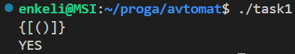

Не соблюдена вложенность. При входе закрывающей `)` на вершине стека не была обнаружена открывающая `(`, и программа сразу завершилась с `NO`:

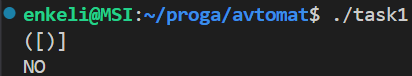

Не хватает закрывающих скобок. Стек оказался не пуст в конце выполнения программы, значит `NO`:

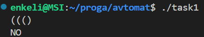

Не соблюдена вложенность. При входе закрывающей `]` на вершине стека не была обнаружена открывающая `[`, и программа сразу завершилась с `NO`:


Программа корректно работает и со строками, в которых присутствуют не только скобки, а и другие символы.

Все корректно:

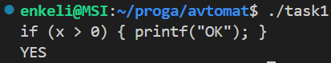

Не хватает закрывающей `}`, значит стек в конце оказался не пуст:

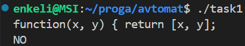

Все корректно:

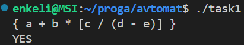

## Задача 4. Арифметические операции с дробями

### 4.2 Постановка задачи

Разработайте программу для выполнения основных операций с обыкновенными дробями. 
- **Вход.** Одна строка в формате `A/B op C/D`, где `A/B` и `C/D` – две дроби (числитель и знаменатель – целые числа, знаменатель не равен 0), а `op` – один из операторов `+`, `-`, `*` или `/`. 
- **Выход.** Результат операции в виде несократимой дроби `P/Q` (числитель и знаменатель — целые числа без общих делителей, знаменатель положительный). Если в результате получается целое число, вывести его как дробь с знаменателем `1` (например, `3/1`). 
- **Требования.** Представить дроби с помощью структуры (с полями для числителя и знаменателя). Реализовать функции для вычисления суммы, разности, произведения и частного дробей, а также функцию для сокращения дроби (например, с использованием алгоритма Евклида для нахождения НОД). Программа должна корректно обрабатывать отрицательные дроби и случаи, когда в ходе вычислений происходит сокращение. В случае попытки деления на ноль (например, во входных данных знаменатель одной из дробей равен 0 или второй операнд равен 0/что-то при делении) вывести сообщение об ошибке.

### 4.3 Математическая модель

Дано:

$$
f1 ​= \frac{a_1​}{b_1}​​, f2​ = \frac{a_2}{​b_2}​​
$$

#### Сложение:

$$
R = \frac{a_1 b_2 + a_2 b_1}{b_1 b_2}
$$

#### Вычитание:

$$
R = \frac{a_1 b_2 - a_2 b_1}{b_1 b_2}
$$

#### Умножение:

$$
R = \frac{a_1 a_2}{b_1 b_2}
$$

#### Деление:

$$
R = \frac{a_1 b_2}{b_1 a_2}, \quad \text{при} \ a \neq 0
$$

#### НОД:

Поочередно находим остатки от деления числителя и знаменателя, пока остаток не станет равным нулю.

#### Сокращение дроби до несокращаемой:

$$
f = \frac{a}{b} = \frac{a / GCD(a, b)}{b / GCD(a, b)}, \quad \text{где } GCD(a, b)\, - \, \text{НОД(a, b)}
$$

### 4.4 Список идентификаторов

#### Макросы

|   **Имя**    |      **Тип**       | **Описание**                            |
| :----------: | :----------------: | --------------------------------------- |
| `MAX_LENGTH` | `#define` (макрос) | Максимальная длина входной строки (100) |

#### Структуры и поля

|    **Имя**    |     **Тип**      | **Описание**                      |
| :-----------: | :--------------: | --------------------------------- |
|  `Fraction`   | `typedef struct` | Структура для представления дроби |
|  `numerator`  |      `int`       | Числитель дроби                   |
| `denominator` |      `int`       | Знаменатель дроби                 |

#### Функции

|     **Имя**      |            **Тип**             | **Описание**                               |
| :--------------: | :----------------------------: | ------------------------------------------ |
|      `GCD`       |        `int(int, int)`         | Вычисление наибольшего общего делителя     |
|    `reducing`    |      `Fraction(Fraction)`      | Сокращение дроби до несокращаемой          |
| `make_fraction`  |      `Fraction(int, int)`      | Создание и автоматическое сокращение дроби |
|    `addition`    | `Fraction(Fraction, Fraction)` | Сложение двух дробей                       |
|  `substraction`  | `Fraction(Fraction, Fraction)` | Вычитание одной дроби из другой            |
| `multiplication` | `Fraction(Fraction, Fraction)` | Умножение двух дробей                      |
|    `division`    | `Fraction(Fraction, Fraction)` | Деление одной дроби на другую              |
|      `main`      |          `int(void)`           | Главная функция программы                  |

#### Переменные в `main`

|   **Имя**   |      **Тип**       | **Описание**                                        |
| :---------: | :----------------: | --------------------------------------------------- |
|  `buffer`   | `char[MAX_LENGTH]` | Буфер для хранения вводимой строки                  |
| `operation` |       `char`       | Символ арифметической операции (`+`, `-`, `*`, `/`) |
|  `f1, f2`   |     `Fraction`     | Две дроби, над которыми выполняется операция        |
|  `result`   |     `Fraction`     | Результат арифметической операции                   |
|   `read`    |       `int`        | Кол-во успешно считанных из строки элементов        |

#### Переменные в функциях

| **Имя** |  **Тип**   | **Описание**                                    |
| :-----: | :--------: | ----------------------------------------------- |
|   `t`   |   `int`    | Временная переменная при нахождении НОД (`GCD`) |
|  `gcd`  |   `int`    | НОД числителя и знаменателя (`reducing`)        |
|   `f`   | `Fraction` | Локальная переменная-дробь (`make_fraction`)    |

### 4.5 Код программы

```c
#include <stdio.h>
#include <stdlib.h>
#include <string.h>
#define MAX_LENGTH 100  // Максимальная длина входной строки

// Структура дроби
typedef struct Fraction {
    int numerator;      // Числитель
    int denominator;    // Знаменатель
} Fraction;

// Объявления функций
int GCD(int a, int b);                          // Функция нахождения НОД
Fraction reducing(Fraction f);                  // Функция сокращения дроби
Fraction make_fraction(int num, int den);       // Функция создания несокращаемой дроби
Fraction addition(Fraction f1, Fraction f2);    // Функция сложения дробей
Fraction substraction(Fraction f1, Fraction f2); // Функция вычитания дробей
Fraction multiplication(Fraction f1, Fraction f2); // Функция умножения дробей
Fraction division(Fraction f1, Fraction f2);    // Функция деления дробей

int main() {
    char buffer[MAX_LENGTH];            // Буфер для хранения входной строки
    char operation;                     // Переменная для хранения символа арифметической операции
    Fraction f1, f2;                    // Дроби f1 и f2 - экземпляры структуры Fraction

    fgets(buffer, MAX_LENGTH, stdin);   // Считываем входную строку и сохраняем ее в buffer
    // Теперь через sscanf() можем форматированно прочитать buffer и сохранить числители и знаменатели дробей и оператор
    int read = sscanf(buffer, "%d/%d %c %d/%d", &f1.numerator, &f1.denominator, &operation, &f2.numerator, &f2.denominator);
    // Переменная read нужна для проверки корректности формата ввода
    if (read != 5) {    // Если sscanf() вернул 5, то все 5 значений успешно считаны
        printf("Invalid input format\n");   // Иначе возвращаем ошибку
        return EXIT_FAILURE;
    }

    // Проверяем, что знаменатели не равны нулю
    if (f1.denominator == 0 || f2.denominator == 0) {
        printf("Invalid fraction: denominator cannot be zero\n");
        return EXIT_FAILURE;
    }

    // Сокращаем входные дроби, чтобы не производить операции с слишком большими числами
    f1 = reducing(f1);
    f2 = reducing(f2);
    Fraction result;

    // Выбор арифметической операции
    switch (operation) {
        case '+':
            result = addition(f1, f2);
            break;
        case '-':
            result = substraction(f1, f2);
            break;
        case '*':
            result = multiplication(f1, f2);
            break;
        case '/':
            // Проверка деления на дробь с нулевым числителем
            if (f2.numerator == 0) {
                printf("Division by zero\n");
                return EXIT_FAILURE;
            }
            result = division(f1, f2);
            break;
        default:
            // Некорректная операция
            printf("Invalid operation\n");
            return EXIT_FAILURE;
    }

    // Сокращаем результат до несокращаемой дроби
    result = reducing(result);
    printf("Answer: %d/%d\n", result.numerator, result.denominator);

    return EXIT_SUCCESS;
}

// Функция нахождения НОД через остаток
int GCD(int a, int b) {
    a = abs(a); // Работаем с модулями во избежание ошибок
    b = abs(b);
    while (b != 0) {
        int t = b;
        b = a % b;
        a = t;
    }
    return a;
}

// Функция сокращения дроби
Fraction reducing(Fraction f) {
    // Если числитель равен нулю, сразу приводим знаменатель к единице
    if (f.numerator == 0) {
        f.denominator = 1;
        return f;
    }

    // Находим НОД числителя и знаменателя и сокращаем их
    int gcd = GCD(f.numerator, f.denominator);
    f.numerator /= gcd;
    f.denominator /= gcd;

    // Обеспечиваем положительный знаменатель
    if (f.denominator < 0) {
        f.numerator = -f.numerator;
        f.denominator = -f.denominator;
    }
    return f;
}

// Функция создания несокращаемой дроби
// Нужна, чтобы избежать повторяющегося кода в функциях операций
Fraction make_fraction(int num, int den) {
    Fraction f = {num, den};
    f = reducing(f);
    return f;
}

// Функция сложения двух дробей
Fraction addition(Fraction f1, Fraction f2) {
    return make_fraction(
        f1.numerator * f2.denominator + f2.numerator * f1.denominator,
        f1.denominator * f2.denominator
    );
}

// Функция вычитания двух дробей
Fraction substraction(Fraction f1, Fraction f2) {
    return make_fraction(
        f1.numerator * f2.denominator - f2.numerator * f1.denominator,
        f1.denominator * f2.denominator
    );
}

// Функция умножения двух дробей
Fraction multiplication(Fraction f1, Fraction f2) {
    return make_fraction(
        f1.numerator * f2.numerator,
        f1.denominator * f2.denominator
    );
}

// Функция деления двух дробей
Fraction division(Fraction f1, Fraction f2) {
    return make_fraction(
        f1.numerator * f2.denominator,
        f1.denominator * f2.numerator
    );
}

```

### 4.6 Результаты работы

#### Корректные результаты:

**Сложение:**

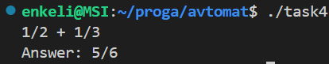

Сначала дроби сокращаются до $\frac{1}{2}$, затем складываются, и итоговый результат $\frac{4}{4}$ сокращается до $\frac{1}{1}$: 

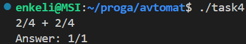

Дроби складываются, и результат $\frac{-2}{-8}$ сокращается до $\frac{1}{4}$,  также в функции `reducing` происходит избавление от минусов, так как знаменатель получился отрицательный:

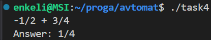

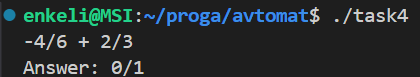

**Вычитание:**


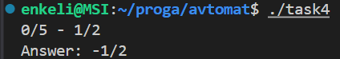

Проверка переноса знака в числитель:

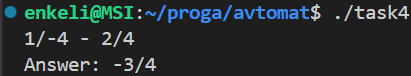

**Умножение:**

Дроби перемножаются и ответ $\frac{6}{12}$ сокращается:

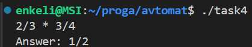

**Деление:**


#### Некорректные результаты (ожидается ошибка):

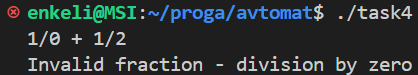

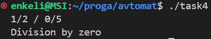

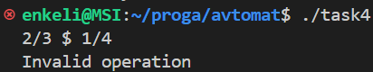

Пробел внутри дроби:

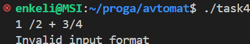

## Задача 11. Динамический массив (Vector) и сборка проекта с Make

### 11.2 Постановка задачи

Разработайте многомодульный проект на C, реализующий тип “динамический массив” с базовыми операциями, и продемонстрируйте его использование. 
- **Описание.** Необходимо создать свой вариант структуры данных, аналогичной `std::vector` в C++ – динамический массив, который может изменять свой размер во время выполнения. Проект должен состоять из нескольких исходных файлов: например, `dynarray.h`, `dynarray.c` (реализация структуры и функций работы с ней) и `main.c` (тестирующий пример использования). 
- **Функционал динамического массива.** реализовать структуру `DynArray` (например, с полями: указатель на область памяти под элементы, текущий размер, текущая ёмкость). Реализовать следующие функции работы с динамическим массивом: 
	- Инициализация массива заданной начальной ёмкости. 
	- Вставка элемента в конец массива (push back). Если текущая ёмкость исчерпана, выделять новый буфер большего размера (например, в 2 раза больше) и переносить данные. 
	- Вставка элемента по указанному индексу (со сдвигом последующих элементов). 
	- Удаление элемента по указанному индексу (со сдвигом последующих элементов влево).
	- Получение элемента по индексу (функция должна возвращать значение или указатель на элемент). 
	- Освобождение памяти массива (деструктор), освобождающий выделенную память. 
- **Демонстрация.** В `main.c` должна быть написана программа, которая демонстрирует работу созданного динамического массива. Например, можно последовательно добавить несколько элементов, вывести содержимое массива, удалить один элемент, снова вывести содержимое и т.д., чтобы показать корректность операций. 
- **Сборка.** Написать Makefile для сборки проекта. Проект должен компилироваться с помощью GNU Make: корректно собираются объектные файлы модуля динамического массива и основной файл, затем компонуется исполняемый файл. В Makefile предусмотреть цели для сборки всего проекта и очистки объектных файлов (`make all`, `make clean`). 
- **Требования.** Все функции должны использовать язык C (не C++). Динамическое перераспределение памяти выполнять с помощью `realloc`/`malloc`. Следует обработать граничные случаи (например, удаление элемента по невалидному индексу – либо игнорировать операцию, либо выводить ошибку). Код должен быть организован по принципам модульности: заголовочный файл с объявлениями и исходный файл с определениями функций. При завершении работы программы освободить всю выделенную память

### 11.3 Математическая модель

нет

### 11.4 Список идентификаторов

#### Макросы

|   **Имя**    |      **Тип**       | **Описание**                                       |
| :----------: | :----------------: | -------------------------------------------------- |
| `DYNARRAY_H` | `#define` (макрос) | Защита от повторного включения заголовочного файла |

#### Структуры и поля

|  **Имя**   |     **Тип**      | **Описание**                    |
| :--------: | :--------------: | ------------------------------- |
| `DynArray` | `typedef struct` | Структура динамического массива |
|   `data`   |      `int*`      | Указатель на массив целых чисел |
|   `size`   |     `size_t`     | Количество элементов в массиве  |
| `capacity` |     `size_t`     | Выделенная вместимость массива  |

#### Функции

|          **Имя**           |             **Тип**             | **Описание**                                                                                |
| :------------------------: | :-----------------------------: | ------------------------------------------------------------------------------------------- |
|      `dynarray_init`       |    `void(DynArray*, size_t)`    | Инициализация массива с заданной вместимостью                                               |
| `dynarray_ensure_capacity` | `void(DynArray*, const char*)`  | Увеличение выделенной памяти (вместимости) при нехватке, используется внутри других функций |
|    `dynarray_pushback`     |     `void(DynArray*, int)`      | Добавление элемента в конец массива                                                         |
|     `dynarray_insert`      | `void(DynArray*, size_t, int)`  | Вставка элемента по индексу                                                                 |
| `dynarray_delete_by_index` |    `void(DynArray*, size_t)`    | Удаление элемента по индексу                                                                |
|     `dynarray_get_ptr`     | `int*(const DynArray*, size_t)` | Получение указателя на элемент по индексу                                                   |
|      `dynarray_print`      |     `void(const DynArray*)`     | Вывод всех элементов массива на экран                                                       |
|      `dynarray_free`       |        `void(DynArray*)`        | Очистка памяти, выделенной под массив                                                       |
|           `main`           |           `int(void)`           | Главная функция программы                                                                   |

#### Переменные в `main`

|  **Имя**  |  **Тип**   | **Описание**                                              |
| :-------: | :--------: | --------------------------------------------------------- |
|   `arr`   | `DynArray` | Экземпляр динамического массива                           |
| `get_ptr` |   `int*`   | Указатель на элемент, полученный через `dynarray_get_ptr` |
|    `i`    |  `size_t`  | Индекс в цикле добавления элементов                       |


### 11.5 Код программы

#### `main.c`:

```c
#include <stdio.h>
#include <stdlib.h>
#include "dynarray.h"

int main() {
    DynArray arr;
    // Инициализируем динамический массив с начальнйо вместимостью 2
    dynarray_init(&arr, 2);

    // Вставляем в конец массива поочередно элементы {10, 20, 30, 40, 50}
    printf("After pushback:\n\t");
    for (size_t i = 1; i < 6; i++)
        dynarray_pushback(&arr, i * 10);
    dynarray_print(&arr);

    // Поочередно вставляем значения 25 и 5 по индексам 2 и 0 соответственно
    // Должно получиться {5, 10, 20, 25, 30, 40, 50}
    printf("After insertion:\n\t");
    dynarray_insert(&arr, 2, 25);
    dynarray_insert(&arr, 0, 5);
    dynarray_print(&arr);

    // Удаляем элемент по индексу 3, то есть 25
    // Должно получиться {5, 10, 20, 30, 40, 50}
    printf("After deletion:\n\t");
    dynarray_delete_by_index(&arr, 3);
    dynarray_print(&arr);

    // Пытаемся удалить элемент по индексу, выходящему за границы
    // Должны получить ошибку
    printf("After deletion with invalid index:\n");
    dynarray_delete_by_index(&arr, 100);

    // Получаем элемент по индексу 3, то есть 30
    int *get_ptr = dynarray_get_ptr(&arr, 3);
    if (get_ptr != NULL)
        printf("Element at index 3: %d\n", *get_ptr);

    // Пытаемся получить элемент по индексу, выходящему за границы
    // Должны получить ошибку
    get_ptr = dynarray_get_ptr(&arr, 100);
    if (get_ptr != NULL)
        printf("Element at index 100: %d\n", *get_ptr);

    // Освобождаем память, выделенную под массив
    dynarray_free(&arr);

    return EXIT_SUCCESS;
}
```

#### `dynarray.c`:

```c
#include <stdio.h>
#include <stdlib.h>
#include <stddef.h>     // Для size_t
#include "dynarray.h"

// Инициализация динамического массива
// init_capacity - начальная вместимость, сколько элементов сможем хранить
void dynarray_init(DynArray *arr, size_t init_capacity) {
    arr->data = (int*)malloc(init_capacity * sizeof(int));  // Выделяем память под массив
    if (arr->data == NULL) {    // Проверка успешного выделения памяти
        fprintf(stderr, "Memory allocation failed in init\n");
        exit(EXIT_FAILURE); // Если не выделилась, прекращаем выполнение программы
    }
    arr->size = 0;                  // Передаем начальный размер массива 0 в поле элемента структуры
    arr->capacity = init_capacity;  // Передаем вместимость
}

// Проверка, хватает ли выделенной памяти, и расширение при необходимости
// context нужен для вывода, во время выполнения какой функции произошла ошибка
void dynarray_ensure_capacity(DynArray *arr, const char *context) {
    if (arr->size == arr->capacity) {   // Если заполненная вся память, выделенная под массив
        size_t new_capacity = arr->capacity > 0 ? arr->capacity * 2 : 1;    // Увеличиваем вместимость в 2 раза
        int *tmp = (int*)realloc(arr->data, new_capacity * sizeof(int));    // Выделяем новую память
        if (tmp == NULL) {  // Проверка успешного выделения памяти
            fprintf(stderr,"Memory allocation failed in %s\n", context);
            exit(EXIT_FAILURE);
        }
        arr->data = tmp;    // Передаем в arr->data указатель на новую память
        arr->capacity = new_capacity;   // Обновляем вместимость
    }
}

// Вставка нового элемента в конец массива
void dynarray_pushback(DynArray *arr, int value) {
    dynarray_ensure_capacity(arr, "pushback");  // Проверяем, хватает ли выделенной памяти
    arr->data[arr->size++] = value;             // Вставляем элемент в конец и увеличиваем size
}

// Вставка элемента по указанному индексу
void dynarray_insert(DynArray *arr, size_t index, int value) {
    if (index > arr->size) {    // Проверяем, не выходит ли индекс за границы массива
        fprintf(stderr, "Invalid index in insert: %zu\n", index);
        return; // Завершаем выполнение функции
    }

    dynarray_ensure_capacity(arr, "insert");    // Проверяем, хватает ли выделенной памяти

    // Сдвигаем элементы вправо от индекса вставки
    for (size_t i = arr->size; i > index; i--) {
        arr->data[i] = arr->data[i - 1];
    }
    // Вставляем значение и увеличиваем size
    arr->data[index] = value;
    arr->size++;
}

// Удаление элемента по индексу
void dynarray_delete_by_index(DynArray *arr, size_t index) {
    if (index >= arr->size) {   // Проверяем, не выходит ли индекс за границы массива
        fprintf(stderr, "Invalid index in delete_by_index: %zu\n", index);
        return;
    }
    // Сдвигаем элементы влево от индекса удаления и уменьшаем size
    for (size_t i = index; i < arr->size - 1; i++) {
        arr->data[i] = arr->data[i + 1];
    }
    arr->size--;
}

// Получение указателя на значение по индексу
int* dynarray_get_ptr(const DynArray *arr, size_t index) {
    // Если индекс выходит за границы массива, возвращаем NULL
    if (index >= arr->size) {
        fprintf(stderr, "Invalid index in get: %zu\n", index);
        return NULL;
    }
    return &arr->data[index];   // Возврашаем адрес элемента по указанному индексу
}

// Вывод элементов массива на экран
void dynarray_print(const DynArray *arr) {
    for (size_t i = 0; i < arr->size; i++) {
        printf("%d ", arr->data[i]);
    }
    printf("\n");
}

// Освобождение памяти, выделенной под массив (деструктор)
void dynarray_free(DynArray *arr) {
    free(arr->data);    // Освобождаем память
    arr->data = NULL;   // Обнуляем указатель на сам массив
    arr->size = 0;      // Обнуляем размер массива
    arr->capacity = 0;  // Обнуляем вместимость
    
    // Проверяем, успешно ли освободилась память
    if (arr->data == NULL) {
        printf("\nMemory cleared succesfully\n");
    } else {
        fprintf(stderr, "\nMemory has not cleared\n");
    }
}
```

#### `dynarray.h`:

```c
#ifndef DYNARRAY_H  // Проверка на повторное включение заголовочного файла
#define DYNARRAY_H

#include <stddef.h> // Для size_t

// Структура динамического массива целых чисел
typedef struct DynArray {
    int *data;          // Указатель на массив данных
    size_t size;        // Размер массива
    size_t capacity;    // Общая вместимость (количество выделенных ячеек памяти)
} DynArray;

// Функция инициализации динамического массива: 
// выделяет память, передает начальную вместимость и устанавливает размер массива 0
void dynarray_init(DynArray *arr, size_t init_capacity);

// Функция проверки нехватки выделенной памяти:
// увеличивает вместимость массива, если он полностью заполнен
void dynarray_ensure_capacity(DynArray *arr, const char *context);

// Функция вставки нового значения в конец массива
void dynarray_pushback(DynArray *arr, int value);

// Функция вставки значения по указанному индексу
void dynarray_insert(DynArray *arr, size_t index, int value);

// Функция удаления элемента по указанному индексу
void dynarray_delete_by_index(DynArray *arr, size_t index);

// Функция получения адреса значения по указанному индексу
int* dynarray_get_ptr(const DynArray *arr, size_t index);

// Функция вывода элементов массива
void dynarray_print(const DynArray *arr);


// Функция освобождения памяти, выделенной под массив (деструктор)
void dynarray_free(DynArray *arr);

#endif // DYNARRAY_H

```

#### `Makefile`

```Makefile
# Компилятор
CC := gcc

# Флаги компиляции: 
# -Wall и -Wextra включают предупреждения компилятора, 
# -std=c11 указывает компилятору использовать стандарт языка C11, 
# O2 - уровень оптимизации
CFLAGS := -Wall -Wextra -std=c11 -O2

# Флаги компоновщика для линковки (не нужны здесь)
LDFLAGS :=

# Библиотеки для линковки (не нужны здесь)
LDLIBS :=

# Исходные файлы проекта
SRC := main.c dynarray.c

# Объектные файлы (во всех файлах  из SRC заменяем .c на .o)
OBJ := $(SRC:.c=.o)

# Имя исполняемого файла
TARGET := proj_dynarray

# Цель по умолчанию (сборка проекта)
all: $(TARGET)

# Сборка исполняемого файла из объектных
# $(CC) $(LDFLAGS) $(OBJ) -o $@ $(LDLIBS) эквивалентно gcc main.o dynarray.o -o proj_dynarray
# LDFLAGS отсутствуют, LDLIBS тоже здесь отсутствуют
$(TARGET): $(OBJ)
	$(CC) $(LDFLAGS) $(OBJ) -o $@ $(LDLIBS)

# Сборка .o из .c (опционально, GNU Make сам это понимает, но лучше указать явно)
# Для main.c $(CC) $(CFLAGS) -c $< -o $@ эквивалентно gcc -Wall -Wextra -std=c11 -O2 -c main.c -o main.o
%.o: %.c
	$(CC) $(CFLAGS) -c $< -o $@

# Очистка (удалить объектные и исполняемый файлы)
clean:
	$(RM) $(OBJ) $(TARGET)
```

### 11.6 Результаты работы

Можно видеть, что сборка проекта прошла успешно. Далее запускаем исполняемый файл `proj_dynarray`. После последовательного добавления пяти элементов в массив, `capacity`, которого инициализировалась как 2, видно, что все пять элементов были успешно добавлены, а значит память была успешно перевыделена с большей вместимостью во время выполнения функции `dynarray_pushback`. Далее были успешно вставлены и удалены значения по указанным индексам. В случае удаления по невалидному индексу (100) была выброшена ошибка. Получение элемента по индексу 3 прошло успешно, а в случае получения элемента по индексу 100, получаем ошибку. Также видим сообщение от функции деструктора об успешном освобождении выделенной памяти. `make clean` удалил все объектные файлы и исполняемый файл.

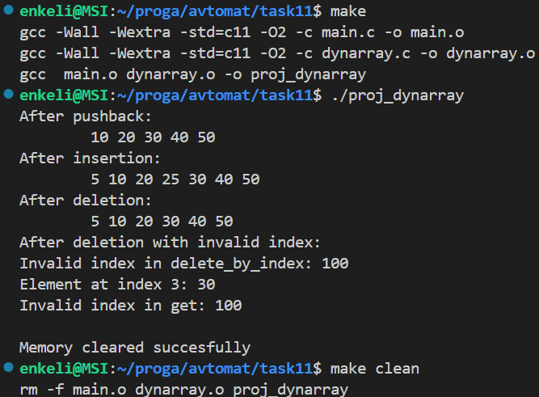

## Задача 13. Фильтрация массива с использованием указателя на функцию

### 13.2 Постановка задачи

Реализуйте функцию фильтрации элементов массива с помощью пользовательской функции–предиката и продемонстрируйте её использование в программе. 
- **Описание задачи.** Необходимо отобрать из заданного списка чисел элементы, соответствующие определённым условиям (например, чётные числа, отрицательные числа), используя для определения условия отдельные функции-предикаты. 
- **Вход.** Сначала целое число `N` – количество элементов. Далее задаётся `N` целых чисел (в одной строке или в нескольких – программа должна корректно их считать). 
- **Выход.** Две строки. Первая содержит все чётные числа из исходного массива, разделённые пробелами, предшествует список словом "`Even:`" (если чётных чисел нет, после "`Even:`" ничего не выводится). Вторая содержит все отрицательные числа, предшествует словом "`Negative:`". Например: 
```bash
	Even: 4 10 6
	Negative: -3 -1
```
Если ни один элемент не удовлетворяет условию, после двоеточия будет пустая строка. 

- **Требования к реализации.** Написать функцию фильтрации, например: 
``` c
	// отбирает элементы массива arr длины n, удовл. предикату pred; 
	// возвращает новый массив-результат (динамически выделенный), 
	// а количество отобранных элементов записывает в *outCount 
	int* filter(int *arr, size_t n, int (*pred)(int), size_t *outCount); 
```

Функция `pred` – указатель на функцию, принимающую целое число и возвращающую 1 (если число удовлетворяет условию) или 0 (иначе). В программе определить две такие функции-предикаты: одна проверяет, является ли число чётным, вторая – является ли число отрицательным. В основном коде использовать функцию `filter` дважды – для получения массива чётных и массива отрицательных чисел из исходного списка. Результаты выводить в требуемом формате. Выделенную динамически память под результаты (новые массивы) освобождать после использования. Программа должна быть написана таким образом, чтобы легко можно было добавлять новые условия фильтрации (новые функции-предикаты) и применять их через универсальную функцию `filter`.

### 13.3 Математическая модель

$$
\begin{matrix}
a \text{ четно, если } mod(a, 2) = 0 \\
a \text{ отрицательно, если } a < 0
\end{matrix}
$$

### 13.4 Список идентификаторов

#### Функции

|   **Имя**    |                            **Тип**                             | Описание                                                                                           |
| :----------: | :------------------------------------------------------------: | -------------------------------------------------------------------------------------------------- |
|   `filter`   | `int*(int *arr, size_t n, int (*pred)(int), size_t *outCount)` | Фильтрует массив по предикату, возвращает новый массив и записывает его длину по адресу `outCount` |
|   `isEven`   |                           `int(int)`                           | Функция-предикат: проверяет, является ли число чётным                                              |
| `isNegative` |                           `int(int)`                           | Функция-предикат: проверяет, является ли число отрицательным                                       |
|    `main`    |                          `int(void)`                           | Главная функция программы                                                                          |

#### Переменные в `main`

|  **Имя переменной**  | **Тип**  | Описание                                       |
| :------------------: | :------: | ---------------------------------------------- |
|         `N`          |  `int`   | Количество вводимых элементов массива          |
|      `numbers`       |  `int*`  | Исходный массив чисел, введённых пользователем |
|   `count_of_evens`   | `size_t` | Число чётных элементов после фильтрации        |
| `count_of_negatives` | `size_t` | Число отрицательных элементов после фильтрации |
|       `evens`        |  `int*`  | Указатель на массив чётных чисел               |
|     `negatives`      |  `int*`  | Указатель на массив отрицательных чисел        |

#### Переменные в функции `filter`

| **Имя переменной** | **Тип**  | **Описание**                                                   |
| :----------------: | :------: | -------------------------------------------------------------- |
|      `count`       | `size_t` | Счётчик элементов, удовлетворяющих условию фильтрации          |
|      `result`      |  `int*`  | Новый массив с элементами, удовлетворяющими условию фильтрации |
|        `j`         | `size_t` | Индекс для записи в массив `result`                            |
|        `i`         | `size_t` | Индекс прохода по `arr`                                        |

### 13.5 Код программы

```c
#include <stdio.h>
#include <stdbool.h>
#include <stdlib.h>

int* filter(int *arr, size_t n, int (*pred)(int), size_t *outCount); // Функция фильтрации
int isEven(int x);      // Функция-предикат, проверяющая четность
int isNegative(int x);  // Функция-предикат, проверяющая отрицательность

int main() {
    int N;
    scanf("%d", &N);
    // Выделяем динамически память под массив из целых чисел длины N
    // и записываем в него входные числа
    int *numbers = (int*)malloc(N * sizeof(int));
    for (int i = 0; i < N; i++) {
        scanf("%d", &numbers[i]);
    }
    // Переменные для хранения количества элементов после фильтрации
    size_t count_of_evens;
    size_t count_of_negatives;
    // Вызываем функцию фильтрации для isEven и isNegative и сохраняем результаты
    int *evens = filter(numbers, N, isEven, &count_of_evens);
    int *negatives = filter(numbers, N, isNegative, &count_of_negatives);

    // Выводим результаты
    printf("Even: ");
    for (size_t i = 0; i < count_of_evens; i++) {
        printf("%d ", evens[i]);
    }
    printf("\n");

    printf("Negative: ");
    for (size_t i = 0; i < count_of_negatives; i++) {
        printf("%d ", negatives[i]);
    }
    printf("\n");

    // Освобождаем выделенную память
    free(evens);
    free(negatives);
    free(numbers);

    return EXIT_SUCCESS;
}

// Функция фильтрации элементов массива
// принимает указатель на массив arr длины n
// фильтрует его по условию pred
// возвращает указатель на отфильтрованный массив, а его длину записывает в *outCount
int* filter(int *arr, size_t n, int (*pred)(int), size_t *outCount) {
    size_t count = 0;
    // Подсчитываем количество элементов, удовлетворяющих условию
    // чтобы выделить память для этого числа элементов
    for (size_t i = 0; i < n; i++) {
        if (pred(arr[i])) {
            count++;
        }
    }

    // Если таких элементов нет, возращаем NULL и в *outCount записываем 0
    if (count == 0) {
        *outCount = 0;
        return NULL;
    }
    // Выделяем динамическую память под отфильтрованный массив
    int *result = (int*)malloc(count * sizeof(int));
    if (result == NULL) {
        printf("Memory allocation failed\n");
        exit(EXIT_FAILURE);
    }

    // Записываем в отфильтрованный массив элементы, удовлетворяющие условию
    size_t j = 0;
    for (size_t i = 0; i < n; i++) {
        if (pred(arr[i])) {
            result[j++] = arr[i];
        }
    }

    // Записываем в *outCount длину отфильтрованного массива
    // и возвращаем указатель на этот массив
    *outCount = count;
    return result;
}

// Функция-предикат: возвращает 1, если x четное
int isEven(int x) {
    return x % 2 == 0;
}

// Функция-предикат: возвращает 1, если x отрицательное
int isNegative(int x) {
    return x < 0;
}
```

### 13.6 Результаты работы

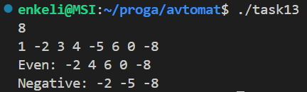

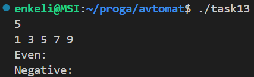

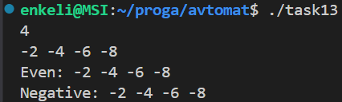

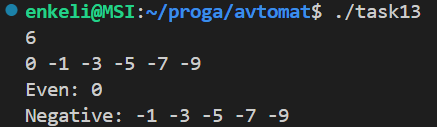

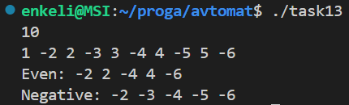
# 7. Трофимцова Екатерина, 1 курс, группа ИВТ-1, подгруппа 2