# 1. Тема лабораторной работы №1: Задачи

## Комплект 1: Начала программирования. Операторы, вычисления, ввод-вывод.
### Задача 1.1
#### 1.1.2 Постановка задачи
Установить предложенную для работы среду программирования. Использовать одну из интегрированных сред разработки: Visual Studio Code (VS Code), VSCodium, XCode, Code::Blocks, CLion, Atom. Также следует установить компилятор GCC, который может быть доступен в режиме командной строки. Для продвинутых пользователей Windows: вместо MinGW вы можете использовать Linux Subsystem в Windows 10/11: Using C++ and WSL in VS Code
#### 1.1.6 Результаты работы
Была установлена интегрированная среда разработки (IDE) **Visual Studio Code (VS Code)**, внутри IDE было установлено расширение **C/C++**, по следующей инструкции: https://code.visualstudio.com/docs/languages/cpp. Вместо компилятора **MinGW** была установлена **WSL** по инструкции: https://code.visualstudio.com/docs/cpp/config-wsl.
### Задача 1.2
#### 1.2.2 Постановка задачи
Написать простую программу. Ввести два числа с клавиатуры, вычислить их сумму и напечатать результат. Использовать функцию `printf` для приглашений на ввод и для распечатки результата. Использовать функцию `scanf` для ввода каждого числа отдельно с клавиатуры. Для получения доступа к функциям `printf` и `scanf` включить в программу заголовочный файл `stdio.h`. Использовать корректные спецификаторы форматирования. Здесь и далее для распечатки надписей на экране использовать латинские буквы для избежания проблем с кодировками символов.
#### 1.2.3 Математическая модель

$$
sum = a + b
$$

#### 1.2.4 Список идентификаторов
| Имя переменной | Тип данных | Описание         |
| :------------: | :--------: | ---------------- |
|       a        |    int     | Первое слагаемое |
|       b        |    int     | Второе слагаемое |
#### 1.2.5 Код программы
```c
#include <stdio.h>

int main() {
    int a, b;
    printf("Input a: ");
    scanf("%d", &a);
    printf("Input b: ");
    scanf("%d", &b);
    printf("a + b = %d\n", a + b);
    
    return 0;
}
```
#### 1.2.6 Результаты работы
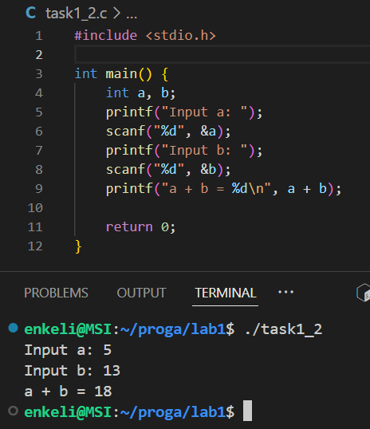
### Задача 1.3
#### 1.3.2 Постановка задачи
Вычислить значение выражения $u(x, y)$, введя $x$ и $y$ с клавиатуры. Подберите значения аргументов $x$ и $y$ самостоятельно за исключением тривиальных значений. Напечатайте вычисленное значение $u(x, y)$ на экране. Включить в программу заголовочный файл `math.h` для доступа к математическим функциям.
#### 1.3.3 Математическая модель

$$
u(x, y) = \frac{1 + \sin^2(x + y)}{2 + \Big|{x − \frac{2x^2}{1+|\sin(x+y)|}\Big|}}, 
$$

#### 1.3.4 Список идентификаторов
| Имя переменной | Тип данных | Описание         |
| :------------: | :--------: | ---------------- |
|       x        |   double   | Аргумент функции |
|       y        |   double   | Аргумент функции |
|       u        |   double   | Значение функции |
|       a        |   double   | Числитель        |
|       b        |   double   | Знаменатель      |
#### 1.3.5 Код программы
```c
#include <stdio.h>
#include <math.h>

int main() {
    double x, y, u, a, b;
    printf("Input x: ");
    scanf("%lf", &x);
    printf("Input y: ");
    scanf("%lf", &y);
    a = 1 + sin(x + y) * sin(x + y);
    b = 2 + fabs(x - (2 * x * x) / (1 + fabs(sin(x + y))));
    u = a / b;
    printf("u(x, y) = %lf\n", u);
    
    return 0;
}
```
#### 1.3.6 Результаты работы
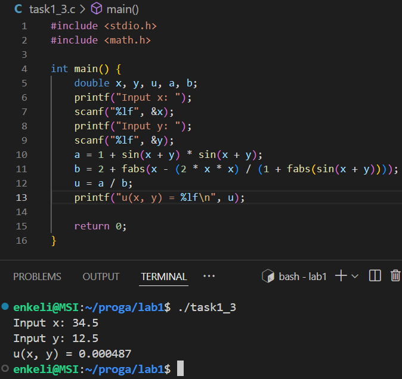
### Задача 1.4
#### 1.4.2 Постановка задачи
Вычислить значение выражения $h(x)$ для следующих значений: 

$$
\begin{matrix} 
a = 0.12, b = 3.5, c = 2.4, x = 1.4;\\ 
a = 0.12, b = 3.5, c = 2.4, x = 1.6;\\
a = 0.27, b = 3.9, c = 2.8, x = 1.8.
\end{matrix}
$$

Значения параметров и аргументов можно вводить прямо в коде программы без ввода с клавиатуры.
#### 1.4.3 Математическая модель

$$
h(x) = −\frac{x − a}{\sqrt[3]{x^2} + a^2} − \frac{4 \sqrt[4]{(x^2 + b^2)^3}}{2 + a + b + \sqrt[3]{(x − c)^2}}.
$$

#### 1.4.4 Список идентификаторов
| Имя переменной | Тип данных | Описание                                                   |
| :------------: | :--------: | ---------------------------------------------------------- |
|       h        |   double   | Пользовательская функция вычисления математической функции |
| a, a1, a2, a3  |   double   | Параметр функции                                           |
| b, b1, b2, b3  |   double   | Параметр функции                                           |
| c, c1, c2, c3  |   double   | Параметр функции                                           |
| x, x1, x2, x3  |   double   | Аргумент функции                                           |
| t1, t2, t3, t4 |   double   | Промежуточная переменная                                   |
#### 1.4.5 Код программы
```c
#include <stdio.h>
#include <math.h>

double h(double a, double b, double c, double x) {
    double t1, t2, t3, t4;

    t1 = x - a;
    t2 = pow(x * x + a * a, 1.0 / 3.0);
    t3 = 4.0 * pow(x * x + b * b, 3.0 / 4.0);
    t4 = 2 + a + b + pow((x - c) * (x - c), 1.0 / 3.0);

    return -t1 / t2 - t3 / t4;
}

int main() {
    double a1 = 0.12, b1 = 3.5, c1 = 2.4, x1 = 1.4;
    double a2 = a1, b2 = b1, c2 = c1, x2 = 1.6;
    double a3 = 0.27, b3 = 3.9, c3 = 2.8, x3 = 1.8;
    printf("For a = %.2f, b = %.2f, c = %.2f, x = %.2f: h(x) = %.2f\n", a1, b1, c1, x1, h(a1, b1, c1, x1));
    printf("For a = %.2f, b = %.2f, c = %.2f, x = %.2f: h(x) = %.2f\n", a2, b2, c2, x2, h(a2, b2, c2, x2));
    printf("For a = %.2f, b = %.2f, c = %.2f, x = %.2f: h(x) = %.2f\n", a3, b3, c3, x3, h(a3, b3, c3, x3));
    return 0;
}
```
#### 1.4.6 Результаты работы
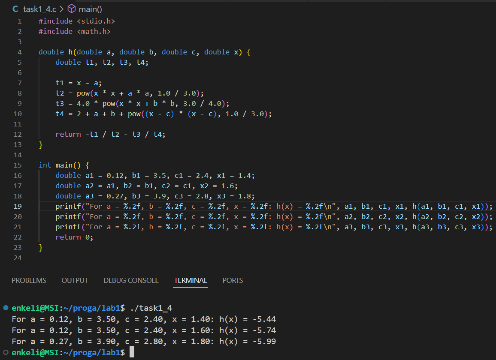
## Комплект 2: Организация циклов. Условные конструкции.
### Задача 2.1
#### 2.1.2 Постановка задачи
Вычислить используя цикл `for` координаты планеты Марс относительно Земли с течением времени $t$. Распечатать на экране координаты для каждой итерации по $t$. Подберите подходящие единицы измерения для времени и расстояния.
#### 2.1.3 Математическая модель
Координаты планеты Марс для каждой итерации задаются заданы формулами: 

$$ 
\begin{matrix}x = r_1 \cos(w_1t) − r_2 \cos(w_2t),\\
y = r_1 \sin(w_1t) − r_2 \sin(w_2t),\\
w_1 = \frac{2\pi}{T_1},\\
w_2 = \frac{2\pi}{T_2},
\end{matrix}
$$

где $r_1$ – радиус орбиты Марса, $r_2$ – радиус орбиты Земли, $T_1$ и $T_2$ — периоды обращения указанных планет соответственно, $t$ – каждый заданный момент времени внутри цикла по времени. 
#### 2.1.4 Список идентификаторов
| Имя переменной | Тип данных | Описание                                        |
| :------------: | :--------: | ----------------------------------------------- |
|       r1       |   double   | Радиус орбиты Марса, млн км                     |
|       r2       |   double   | Радиус орбиты Земли, млн км                     |
|       T1       |   double   | Период обращения Марса, сут                     |
|       T2       |   double   | Период обращения Земли, сут                     |
|       w1       |   double   | Угловая скорость Марса, рад/сут                 |
|       w2       |   double   | Угловая скорость Земли, рад/сут                 |
|       t        |   double   | Параметр цикла, каждый заданный момент времени  |
|       x        |   double   | Координата $x$ Марса относительно Земли, млн км |
|       y        |   double   | Координата $y$ Марса относительно Земли, млн км |
#### 2.1.5 Код программы
```c
#include <stdio.h>
#include <math.h>
#define PI 3.14159265358979

int main() {
    double r1 = 228, r2 = 149.6, T1 = 687, T2 = 365;
    double w1 = 2 * PI / T1;
    double w2 = 2 * PI / T2;
    for (int t = 1; t <= 12000; t += 15) {
        double x = r1 * cos(w1 * t) - r2 * cos(w2 * t);
        double y = r1 * sin(w1 * t) - r2 * sin(w2 * t);
        printf("t = %d сут \t x = %.3f млн км \t y = %.3f млн км\n", t, x, y);
    }

    return 0;
}
```
#### 2.1.6 Результаты работы
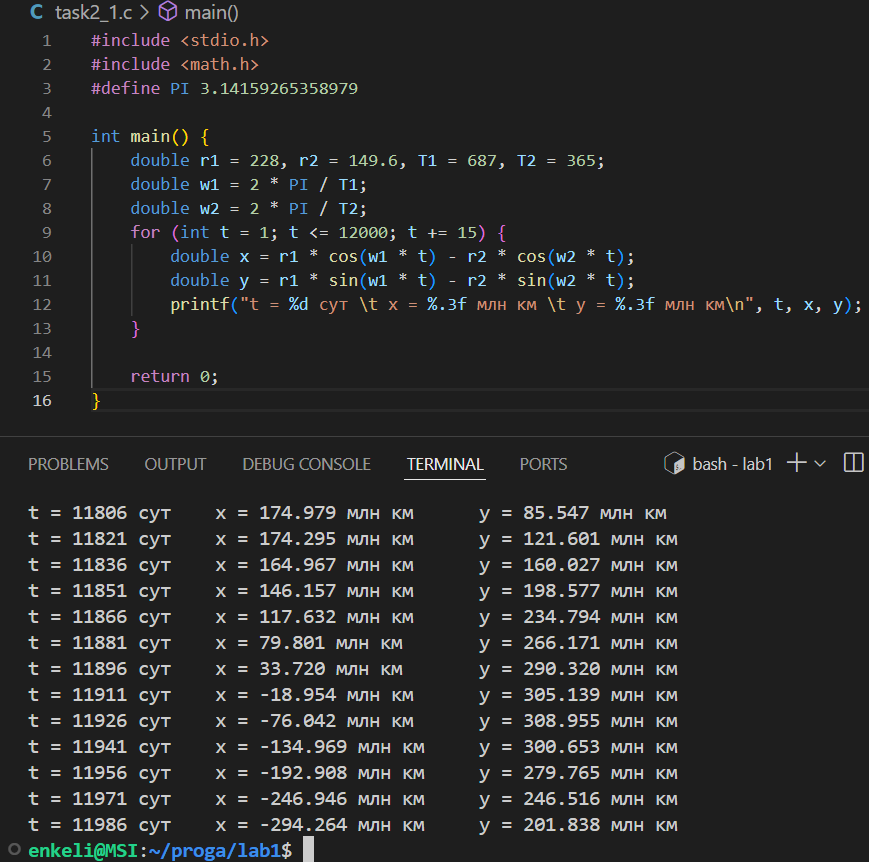
### Задача 2.2
#### 2.2.2 Постановка задачи
Вычислить определённый интеграл от заданной функции методом трапеций: 

$$
\int\limits_a^b f(x)dx = \int\limits_a^b e^{x+2}dx .
$$

Функция $f(x)$ может быть выбрана и самостоятельно. Результат интегрирования сравнить с вычисленным вручную и убедиться в корректности результата.
#### 2.2.3 Математическая модель

$$
\int\limits_a^b f(x)dx = h \cdot \Bigg( \frac{f(a) + f(b)}{2} + \sum_{x=a+h}^{b-h} f(x) \Bigg)
$$

#### 2.2.4 Список идентификаторов
| Имя переменной | Тип данных | Описание                                                                            |
| :------------: | :--------: | ----------------------------------------------------------------------------------- |
|    integral    |   double   | Пользовательская функция вычисления определенного интеграла методом трапеций        |
|       a        |   double   | Нижняя граница определенного интеграла                                              |
|       b        |   double   | Верхняя граница определенного интеграла                                             |
|       n        |   double   | Количество равных частей, на которые разбивается промежуток интегрирования $[a, b]$ |
|       h        |   double   | Шаг интегрирования, шаг параметра цикла                                             |
|       S        |   double   | Сумма - результат выполнения цикла                                                  |
|       x        |   double   | Параметр цикла                                                                      |
|       f        |   double   | Значение подынтегральной функции в точке $x$                                        |
|       fa       |   double   | Значение функции в точке $a$                                                        |
|       fb       |   double   | Значение функции в точке $b$                                                        |
|      res       |   double   | Итоговое значение определенного интеграла                                           |
#### 2.2.5 Код программы
```c
#include <stdio.h>
#include <math.h>
#define E 2.7182818284

double integral(double a, double b, double n) {
    double h = (b - a) / n;
    double S = 0;

    for (double x = a + h; x <= b - h + h / 2; x += h) {
        double f = pow(E, x + 2);
        S += f;
    }

    double fa = pow(E, a + 2);
    double fb = pow(E, b + 2);
    double res = h * ((fa + fb) / 2 + S);
    return res;
}

int main() {
    double n, a, b;
    printf("Input number of parts: n = ");
    scanf("%lf", &n);
    printf("Input a: a = ");
    scanf("%lf", &a);
    printf("Input b: b = ");
    scanf("%lf", &b);

    printf("%.10f\n", integral(a, b, n));

    return 0;
}
```
#### 2.2.6 Результаты работы
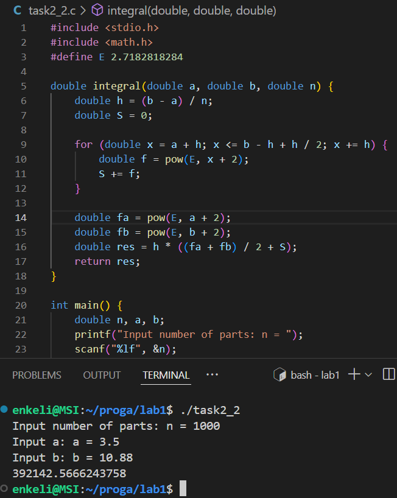
### Задача 2.3
#### 2.3.2 Постановка задачи
Организовать и распечатать последовательность чисел Падована , не превосходящих число $m$, введенное с клавиатуры. Числа Падована представлены следующим рядом: `1, 1, 1, 2, 2, 3, 4, 5, 7, 9, 12, 16, 21, 28, 37, 49, 65, 86, 114, 151, 200, 265, ...` Использовать конструкцию `for` и простые варианты условной конструкции `if else`.
#### 2.3.3 Математическая модель
Для этих чисел заданы формулы: 

$$
\begin{matrix}P(0) = P(1) = P(2) = 1 ,\\
P(n) = P(n − 2) + P(n − 3).\end{matrix}
$$

#### 2.3.4 Список идентификаторов
| Имя переменной | Тип данных | Описание                                                                                                       |
| :------------: | :--------: | -------------------------------------------------------------------------------------------------------------- |
|       m        |    int     | Число, введенное с клавиатуры, не превосходя которое должна быть распечатана последовательность чисел Падована |
|   p0, p1, p2   |    int     | Первые три члена последовательности, а затем промежуточные переменные для обмена значениями                    |
|       p        |    int     | Последний вычисленный член последовательности                                                                  |
#### 2.3.5 Код программы
```c
#include <stdio.h>

int main() {
    int m;
    printf("Input m: m = ");
    scanf("%d", &m);
    int p0, p1, p2;
    p0 = p1 = p2 = 1;
    printf("Padovan sequence (< m = %d): %d, %d, %d, ", m, p0, p1, p2);

    for (int p = p0 + p1; p <= m; p = p0 + p1) { 
        printf("%d, ", p);
        p0 = p1;
        p1 = p2;
        p2 = p;
    }

    printf("...\n");

    return 0;
}
```
#### 2.3.6 Результаты работы
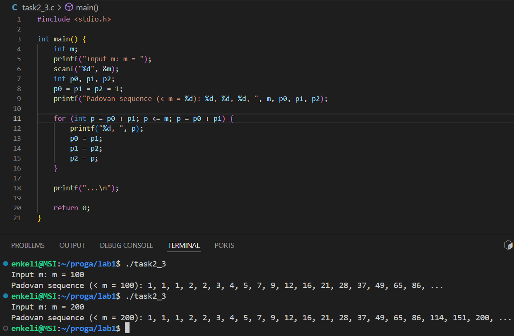
### Задача 2.4
#### 2.4.2 Постановка задачи
С клавиатуры вводится трёхзначное число, считается сумма его цифр. Если сумма цифр числа больше 10, то вводится следующее трёхзначное число, если сумма меньше либо равна 10 — программа завершается.
#### 2.4.3 Математическая модель
Сумма цифр трехзначного числа:

$$
sum = (x/100) + ((x \\% 100) / 10) + (x \\% 100)
$$

#### 2.4.4 Список идентификаторов
| Имя переменной | Тип данных | Описание                                 |
| :------------: | :--------: | ---------------------------------------- |
|      sum       |    int     | Сумма цифр трехзначного числа            |
|       x        |    int     | Трехзначное число, вводимое с клавиатуры |
#### 2.4.5 Код программы
```c
#include <stdio.h>

int main() {
    int sum;
    do {
        int x;
        printf("Input a three-digit number: ");
        scanf("%d", &x);
        sum = (x / 100) + ((x % 100) / 10) + (x % 10);
        printf("Sum of digits: %d\n", sum);
    } while (sum > 10);
    
    return 0;
}
```
#### 2.4.6  Результаты работы
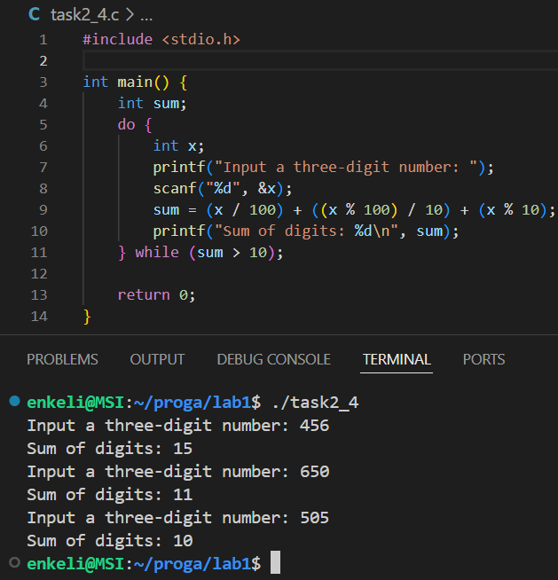
## Комплект 3: Основы работы со статистическими массивами.
### Задача 3.1
#### 3.1.2 Постановка задачи
Для некоторого числового вектора $X$, введённого с клавиатуры, вычислить значения вектора $Y = X · X$ ($y_i = x_i · x_i$ — поэлементно).
#### 3.1.3 Математическая модель

$$
Y = X \cdot X = \begin{pmatrix} x_1 \cdot x_1 \\ x_2 \cdot x_2\\ \vdots \\ x_n \cdot x_n \end{pmatrix}
$$

#### 3.1.4 Список идентификаторов
| Имя переменной | Тип данных | Описание                                  |
| :------------: | :--------: | ----------------------------------------- |
|   vectorX[3]   |    int     | Одномерный массив, вектор $X$             |
|   vectorY[3]   |    int     | Одномерный массив, вектор $Y$             |
|       i        |    int     | Параметр цикла, счетчик элементов массива |
#### 3.1.5 Код программы
```c
#include <stdio.h>

int main() {
    int vectorX[3], vectorY[3];
    printf("Input elements of three-dimensional vector X:\n");
    for (int i = 0; i < 3; i++) {
        scanf("%d", &vectorX[i]);
        vectorY[i] = vectorX[i] * vectorX[i];
    }
    
    printf("Y = ( ");
    for (int i = 0; i < 3; i++)
        printf("%d ", vectorY[i]);
    printf(")\n");

    return 0;
}
```
#### 3.1.6 Результаты работы
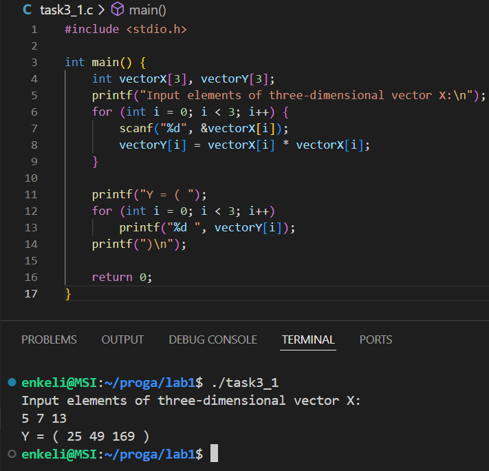
### Задача 3.2
#### 3.2.2 Постановка задачи
Для некоторого числового массива $X$, введённого с клавиатуры поэлементно, изменить порядок элементов на обратный и распечатать результат на экране.
#### 3.2.3 Математическая модель

$$
\begin{pmatrix} x_1 & x_2 & \cdots & x_n \end{pmatrix} \to \begin{pmatrix} x_n & \cdots & x_2 & x_1 \end{pmatrix}
$$

#### 3.2.4 Список идентификаторов
| Имя переменной | Тип данных | Описание                                  |
| :------------: | :--------: | ----------------------------------------- |
|   vector[5]    |    int     | Одномерный массив, вектор $X$             |
|       i        |    int     | Параметр цикла, счетчик элементов вектора |
#### 3.2.5 Код программы
```c
#include <stdio.h>

int main() {
    int vector[5];
    printf("Input 5 elements of array:\n");
    for (int i = 0; i < 5; i++) {
        scanf("%d", &vector[i]);
    }
    
    printf("Reverse: ");
    for (int i = 4; i > -1; i--)
        printf("%d ", vector[i]);
    printf("\n");

    return 0;
}
```
#### 3.2.6 Результаты работы
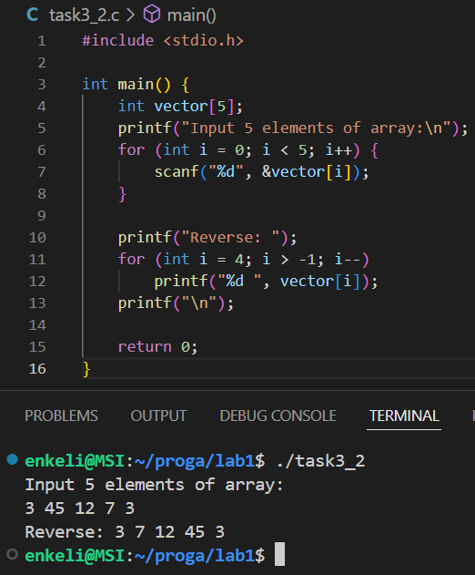
### Задача 3.3
#### 3.3.2 Постановка задачи
Транспонировать матрицу:

$$
A = \begin{bmatrix} 
1 & 2 & 3 \\ 
4 & 5 & 6 \\
7 & 8 & 9 
\end{bmatrix}
$$

#### 3.3.3 Математическая модель

$$
A = \begin{bmatrix} 
1 & 2 & 3 \\ 
4 & 5 & 6 \\
7 & 8 & 9 
\end{bmatrix} \to 
A^T = \begin{bmatrix} 
1 & 4 & 7 \\ 
2 & 5 & 8 \\
3 & 6 & 9 
\end{bmatrix}
$$

#### 3.3.4 Список идентификаторов
| Имя переменной | Тип данных | Описание                                 |
| :------------: | :--------: | ---------------------------------------- |
|    A[3][3]     |    int     | Массив 3х3, матрица $A$                  |
|       i        |    int     | Параметр цикла, счетчик строк матрицы    |
|       j        |    int     | Параметр цикла, счетчик столбцов матрицы |
#### 3.3.5 Код программы
```c
#include <stdio.h>

int main() {
    int A[3][3] = {{1, 2, 3},
                   {4, 5, 6},
                   {7, 8, 9}};
    
    for (int i = 0; i < 3; i++) {
        for (int j = 0; j < 3; j++)
            printf("%3.d ", A[j][i]);
        printf("\n");    
    }

    return 0;
}
```
#### 3.3.6 Результаты работы
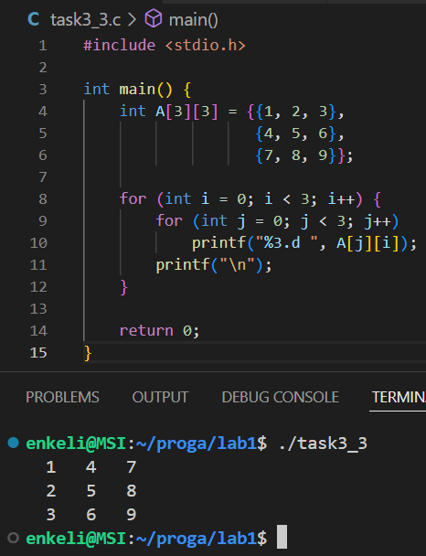
### Задача 3.4
#### 3.4.2 Постановка задачи
Преобразовать исходную матрицу так, чтобы первый элемент каждой строки был заменён средним арифметическим элементов этой строки.
#### 3.4.3 Математическая модель

$$
\begin{bmatrix} 
a_{11} & a_{12} & a_{13} \\ 
a_{21} & a_{22} & a_{23} \\
a_{31} & a_{32} & a_{33} 
\end{bmatrix} \to 
\begin{bmatrix} 
\frac{a_{11} + a_{12} + a_{13}}{3} & a_{12} & a_{13} \\ 
\frac{a_{21} + a_{22} + a_{23}}{3} & a_{22} & a_{23} \\
\frac{a_{31} + a_{32} + a_{33}}{3} & a_{32} & a_{33} 
\end{bmatrix}
$$

#### 3.4.4 Список идентификаторов
| Имя переменной | Тип данных | Описание                                 |
| :------------: | :--------: | ---------------------------------------- |
|    A[3][3]     |   double   | Массив 3х3, матрица $A$                  |
|       i        |    int     | Параметр цикла, счетчик строк матрицы    |
|       j        |    int     | Параметр цикла, счетчик столбцов матрицы |
|      sum       |   double   | Сумма элементов строки                   |
|      avg       |   double   | Среднее арифметическое элементов строки  |
#### 3.4.5 Код программы
```c
#include <stdio.h>

int main() {
    double A[3][3] = {{5, 12, 8},
                      {7, 3, 14},
                      {9, 6, 2}};
    
    for (int i = 0; i < 3; i++) {
        double sum = 0;
        for (int j = 0; j < 3; j++)
            sum += A[i][j];
        double avg = sum / 3.;
        A[i][0] = avg;
    }

    for (int i = 0; i < 3; i++) {
        for (int j = 0; j < 3; j++)
            printf("%5.2lf ", A[i][j]);
        printf("\n");    
    }

    return 0;
}
```
#### 3.4.6 Результаты работы
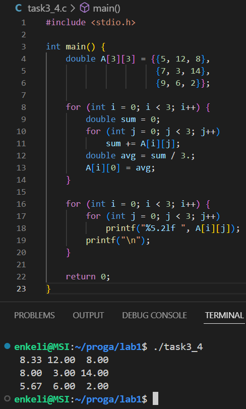
### Задача 3.5
#### 3.5.2 Постановка задачи
Реализовать самостоятельно алгоритм сортировки вставками (без создания своих функций, внутри функции `main`). Пример: https:/habr.com/ru/post/181271/ .
#### 3.5.3 Математическая модель

$$
-
$$

#### 3.5.4 Список идентификаторов
| Имя переменной | Тип данных | Описание                      |
| :------------: | :--------: | ----------------------------- |
|    list[10]    |    int     | Массив целочисленных значений |
|       i        |    int     | Параметр цикла                |
|       j        |    int     | Параметр цикла                |
#### 3.5.5 Код программы
```c
#include <stdio.h>

int main() {
    int list[10] = {7, 23, 89, 12, 45, 67, 34, 90, 56, 78};

    for (int i = 1; i < 10; i ++) {
        for (int j = i; j > 0 && list[j - 1] > list[j]; j--) {
            int t = list[j];
            list[j] = list[j - 1];
            list[j - 1] = t;
        }
    }

    for (int i = 0; i < 10; i++)
        printf("%d ", list[i]);
    printf("\n");
}
```
#### 3.5.6 Результаты работы
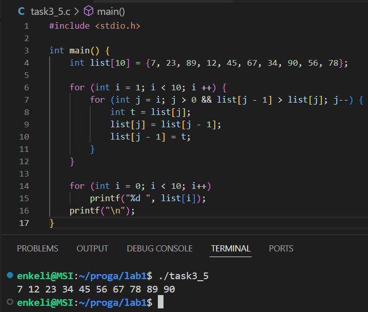
# 7. Трофимцова Екатерина, 1 курс, группа ИВТ-1, подгруппа 2