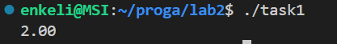
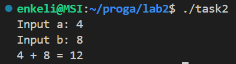
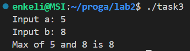
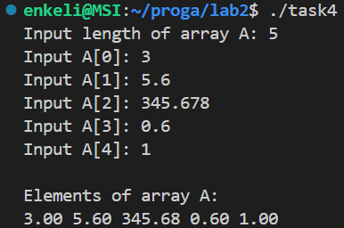
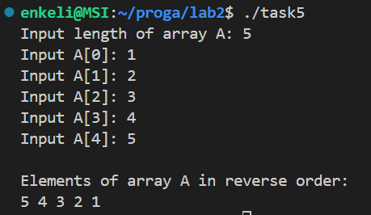
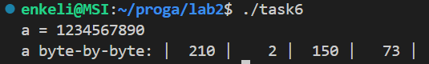
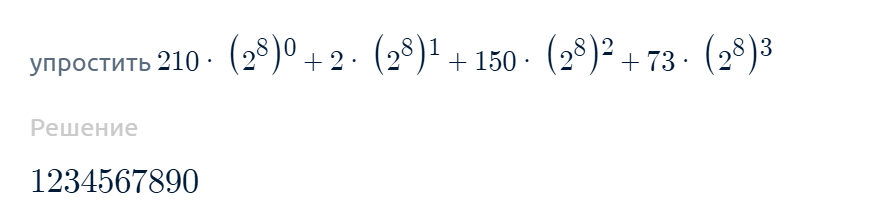
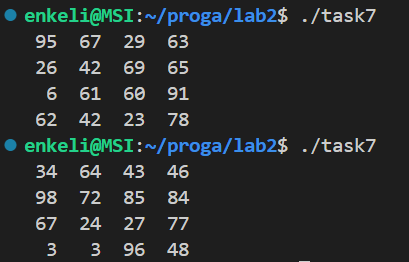

## 1. Тема лабораторной работы №2: Указатели, арифметика указателей

## Задача 1

### 1.2 Постановка задачи

Внутри функции `int main(void) { /*...*/ }` определите указатель double `***pointer = NULL;`. Инициализируйте этот указатель адресом другого указателя типа `double **`, который указывает на переменную `double *`, которая указывает на `double`. Используйте `pointer` для записи и чтения значения `2.0` в сегмент оперативной памяти для `double`.

### 1.3 Математическая модель

$$-$$

### 1.4 Список идентификаторов

| Имя переменной |  Тип данных  | Описание                                                                                   |
| :------------: | :----------: | ------------------------------------------------------------------------------------------ |
|   `pointer`    | `double ***` | Тройной указатель, хранит адрес `double **`.                                               |
|   (неявный)    | `double **`  | Указатель, на который ссылается `pointer`. Создан через `malloc`. Хранит адрес `double*`.  |
|   (неявный)    |  `double *`  | Указатель, на который ссылается `double **`. Создан через `malloc`. Хранит адрес `double`. |
|   (неявный)    |   `double`   | Переменная, в которой хранится `2.0`.                                                      |

### 1.5 Код программы

```c
#include <stdio.h>
#include <stdlib.h>

int main(void)
{
    double ***pointer = NULL;

    *( *( *(pointer = (double ***)malloc(sizeof(double **))) = (double **)malloc(sizeof(double *)) ) = (double *)malloc(sizeof(double)) ) = 2.0;
    // Для самого pointer выделили динамически память, чтобы хранить в нем указатель double**
    // Разыменовали double *** и получили указатель double**
    // Для указателя double** выделили динамически память, чтобы хранить в нем указатель double*
    // Разыменовали double ** и получили указатель double*
    // Для указателя double* выделили динамически память, чтобы хранить в нем double
    // Разыменовали double* и получили double
    // И уже в double записали значение 2.0

    if (pointer == NULL) {      // Проверка на успешное выделение памяти
        return EXIT_FAILURE;
    }
    
    printf("%.2lf\n", ***pointer);
    
    // Постепенно освобождаем динамическую память
    free(**pointer);    // Сначала освобождаем память, выделенную под указатель double*
    free(*pointer);     // Затем освобождаем память, выделенную под указатель double**
    free(pointer);      // Затем освобождаем память, выделенную под указатель double*** (сам указатель pointer)
    
    return EXIT_SUCCESS;
}
```

### 1.6 Результаты работы



## Задача 2. Сложение двух чисел

### 2.2 Постановка задачи

Напишите программу, которая складывает два числа с использованием указателей на эти числа.

### 2.3 Математическая модель

$$-$$

### 2.4 Список идентификаторов

| Имя переменной | Тип данных | Описание                                              |
| :------------: | :--------: | ----------------------------------------------------- |
|      `a`       |   `int`    | Первое слагаемое                                      |
|      `b`       |   `int`    | Второе слагаемое                                      |
|     `sum`      |   `int`    | Переменная для хранения результата сложения `a` и `b` |
|    `ptr_a`     |   `int*`   | Указатель на переменную `a`                           |
|    `ptr_b`     |   `int*`   | Указатель на переменную `b`                           |
|   `ptr_sum`    |   `int*`   | Указатель на переменную `sum`                         |

### 2.5 Код программы

```c
#include <stdio.h>
#include <stdlib.h>

int main(void)
{
    int a, b, sum;                                     // Объявление целочисленных переменных a, b и sum для хранения суммы a и b
    int *ptr_a = &a, *ptr_b = &b, *ptr_sum = &sum;     // Объявление указателей ptr_a, ptr_b и ptr_sum и присвоение им адресов a, b и sum соответственно

    printf("Input a: ");    // Ввод значений a и b и запись их через указатели
    scanf("%d", ptr_a);
    printf("Input b: ");
    scanf("%d", ptr_b);

    *ptr_sum = *ptr_a + *ptr_b;     // Вычисление и запись суммы a и b через разыменовывание указателей

    printf("%d + %d = %d\n", *ptr_a, *ptr_b, *ptr_sum);    // Вывод суммы

    return EXIT_SUCCESS;
}

```

### 2.6 Результаты работы



## Задача 3. Нахождение максимума из двух чисел

### 3.2 Постановка задачи

Напишите программу, которая находит максимальное число из двух чисел, используя указатели на эти числа.

### 3.3 Математическая модель

$$
\text{max} = 
\begin{cases}
a, & \text{если } a \geq b, \\
b, & \text{иначе.}
\end{cases}
$$

### 3.4 Список идентификаторов

| Имя переменной |     Тип данных     | Описание                                         |
| :------------: | :----------------: | ------------------------------------------------ |
|      `a`       |       `int`        | Первое число для сравнения                       |
|      `b`       |       `int`        | Второе число для сравнения                       |
|      `mx`      |       `int`        | Максимум из `a` и `b`                            |
|    `ptr_a`     |       `int*`       | Указатель на переменную `a`                      |
|    `ptr_b`     |       `int*`       | Указатель на переменную `b`                      |
|    `ptr_mx`    |       `int*`       | Указатель на переменную `mx`                     |
|      `x`       |       `int*`       | Параметр функции `find_max` (указатель)          |
|      `y`       |       `int*`       | Параметр функции `find_max` (указатель)          |
|   `find_max`   | `int (int*, int*)` | Функция для нахождения максимума через указатели |
### 3.5 Код программы

```c
#include <stdio.h>
#include <stdlib.h>

int find_max(int *x, int *y);

int main(void)
{
    int a, b, mx;                                   // Объявление целочисленных переменных a, b и mx для хранения максимума из a и b
    int *ptr_a = &a, *ptr_b = &b, *ptr_mx = &mx;    // Объявление указателей ptr_a, ptr_b и ptr_mx и присвоение им адресов a, b и mx соответственно

    printf("Input a: ");    // Ввод значений a и b и сохранение их через указатели
    scanf("%d", ptr_a);
    printf("Input b: ");
    scanf("%d", ptr_b);

    mx = find_max(ptr_a, ptr_b);    // Нахождение максимума из двух чисел a и b с использованием пользовательской функции

    printf("Max of %d and %d is %d\n", a, b, mx);    // Вывод максимума

    return EXIT_SUCCESS;
}

// Функция нахождения максимума из двух чисел
int find_max(int *x, int *y) {
    return (*x > *y) ? *x : *y;
}
```

### 3.6 Результаты работы



## Задача 4. Динамический массив с плавающей точкой

### 4.2 Постановка задачи

Напишите программу, которая создаёт одномерный динамический массив из чисел с плавающей точкой двойной точности, заполняет его значениями с клавиатуры и распечатывает все элементы этого массива, используя арифметику указателей (оператор `+`), а не оператор доступа к элементу массива `[]`.

### 4.3 Математическая модель

$$-$$

### 4.4 Список идентификаторов

| Имя переменной | Тип данных | Описание                                                      |
| :------------: | :--------: | ------------------------------------------------------------- |
|     `len`      |   `int`    | Длина динамического массива                                   |
|      `A`       | `double*`  | Указатель на начало динамического массива чисел типа `double` |
|      `i`       |   `int`    | Параметр цикла для ввода/вывода элементов                     |

### 4.5 Код программы

```c
#include <stdio.h>
#include <stdlib.h>

int main(void) {
    int len;
    printf("Input length of array A: ");
    scanf("%d", &len);

    double *A = (double*)malloc(len * sizeof(double));  // Динамическое выделение памяти для массива A типа double длины len 

    // Проверка на успешное выделение памяти
    if (A == NULL) {
        return EXIT_FAILURE;
    } 
    
    // Ввод элементов массива
    // Каждый проход цикла i увеличивается на 1, а адрес A+i смещается на sizeof(double)
    for (int i = 0; i < len; i++) {
        printf("Input A[%d]: ", i);
        scanf("%lf", A + i);
    }

    // Вывод элементов массива
    // Аналогично, каждый проход цикла i увеличивается на 1, а адрес A+i смещается на sizeof(double)
    printf("\nElements of array A:\n");
    for (int i = 0; i < len; i++) {
        printf("%.2lf ", *(A + i));    // Разыменовая указатель, получаем значение i-го элемента массива
    }
    printf("\n");

    free(A);    // Освобождение динамической памяти, выделенной под массив A
    return EXIT_SUCCESS;
}
```

### 4.6 Результаты работы



## Задача 5. Обратный порядок элементов массива

### 5.2 Постановка задачи

Выведите элементы динамического массива целых чисел в обратном порядке, используя указатель и операцию декремента (`--`).

### 5.3 Математическая модель

$$-$$

### 5.4 Список идентификаторов

| Имя переменной | Тип данных | Описание                                                   |
| :------------: | :--------: | ---------------------------------------------------------- |
|     `len`      |   `int`    | Длина динамического массива                                |
|      `A`       |   `int*`   | Указатель на начало динамического массива чисел типа `int` |
|     `ptr`      |   `int*`   | Указатель для обратного прохода                            |
|      `i`       |   `int`    | Параметр цикла для ввода/вывода элементов                  |

### 5.5 Код программы

```c
#include <stdio.h>
#include <stdlib.h>

int main(void) {
    int len;
    printf("Input length of array A: ");
    scanf("%d", &len);

    int *A = (int*)malloc(len * sizeof(int));  // Динамическое выделение памяти для массива A типа int длины len 
    
    // Проверка на успешное выделение памяти
    if (A == NULL) {
        return EXIT_FAILURE;
    }

    // Ввод элементов массива
    // Каждый проход цикла i увеличивается на 1, а адрес A+i смещается на sizeof(int)
    for (int i = 0; i < len; i++) {
        printf("Input A[%d]: ", i);
        scanf("%d", A + i);
    }

    // Вывод элементов массива
    int *ptr = A + len - 1;     // Устанавливаем указатель на последний элемент
    for (int i = 0; i < len; i++) {
        printf("%d ", *ptr--);  // Разыменовая указатель, получаем значение (len-1-i)-го элемента массива, выводим его и декрементируем указатель
    }
    printf("\n");

    free(A);    // Освобождение динамической памяти, выделенной под массив A
    return EXIT_SUCCESS;
}
```

### 5.6 Результаты работы



## Задача 6. Побайтовый вывод переменной

### 6.2 Постановка задачи

Определите переменную целого типа `int a = 1234567890;` и выведите побайтово её содержимое на экран, используя указатель `char *`.

### 6.3 Математическая модель

$$
1234567890 = 210 * (2^8)^0 + 2 * (2^8)^1 + 150 * (2^8)^2 + 73 * (2^8)^3
$$

### 6.4 Список идентификаторов

| Имя переменной |    Тип данных    | Описание                                                |
| :------------: | :--------------: | ------------------------------------------------------- |
|      `a`       |      `int`       | Целочисленная переменная                                |
|   `charPtr`    | `unsigned char*` | Указатель для доступа к отдельным байтам переменной `a` |
|      `i`       |      `int`       | Параметр цикла для перебора байтов                      |

### 6.5 Код программы

```c
#include <stdio.h>
#include <stdlib.h>

int main(void) {
    int a = 1234567890;
    unsigned char *charPtr = (unsigned char*) &a;
    // Создаем указатель типа unsigned char*, указывающий на первый байт переменной a.
    // unsigned char, так как он хранит значения от 0 до 255,
    // в отличие от char, который хранит значения от -128 до 127, что неудобно для привычного побайтового предстапвления десятичных чисел.

    printf("a = %d\n", a);
    printf("a byte-by-byte: |");
    for (int i = 0; i < sizeof(a); i++) {   // Параметр цикла i изменяется до sizeof(a), т. е. до 4 - размер переменной типа int в байтах.
        printf("%5d |", *(charPtr + i));    // Выводим значение, записанное по адресу, смещенному от charPtr (адреса первого байта переменной a) 
    }                                       // на i байт, так как размер типа char равен 1 байт.
    printf("\n");

    return EXIT_SUCCESS;
}
```

### 6.6 Результаты работы



Проверка полученных значений в онлайн-калькуляторе соответствует и математической модели:

## Задача 7. Двумерный динамический массив

### 7.2 Постановка задачи

Выделите память под двумерный динамический массив, используя массив указателей на строки (см. лекции), и затем корректно освободите оперативную память.

### 7.3 Математическая модель

$$-$$

### 7.4 Список идентификаторов

| Имя переменной | Тип данных | Описание                                     |
| :------------: | :--------: | -------------------------------------------- |
|    `matrix`    |  `int**`   | Указатель на массив указателей строк матрицы |
|    `n_rows`    |   `int`    | Количество строк в матрице                   |
|  `n_columns`   |   `int`    | Количество столбцов в матрице                |
|      `i`       |   `int`    | Параметр цикла для перебора строк матрицы    |
|      `j`       |   `int`    | Параметр цикла для перебора столбцов матрицы |

### 7.5 Код программы

```c
#include <stdio.h>
#include <stdlib.h>
#include <time.h>

int main() {
    // Вызываем srand(), чтобы rand() в дальнейшем брал разные начальные значения при каждом запуске программы
    // и возвращал не те же числа, что и при прошлом запуске
    srand(time(NULL));

    int **matrix = NULL;    // Создаем указатель типа int** - указатель на указатели строк матрицы
    int n_rows = 4;
    int n_columns = 4;

    // Динамически выделяем память для n_rows адресов на одномерные массивы, т. е. адресов на строки матрицы
    // В нашем случае в matrix будет 4 таких адреса на одномерные массивы, то есть 4 строки в матрице
    matrix = (int**)malloc(n_rows * sizeof(int*));
    if (matrix == NULL) {   // Проверка успешного выделения памяти
        return EXIT_FAILURE;
    }

    // В каждом указателе на строку выделяем динамически память для n_columns чисел типа int, т. е. для столбцов матрицы
    // В нашем случае, в каждой сроке будет 4 числа, так как n_columns = 4
    for (int i = 0; i < n_rows; i++) {
        *(matrix + i) = (int*)malloc(n_columns * sizeof(int));
        if (*(matrix + i) == NULL) {    // Проверка успешного выделения памяти
            return EXIT_FAILURE;
        }
    }

    // Последовательно разыменовывая указатели, записываем в качестве значений матрицы случайные числа
    // А именно, остаток от деления значения, возвращаемого функцией rand(), на 100
    for (int i = 0; i < n_rows; i++) {
        for (int j = 0; j < n_columns; j++) {
            *(*(matrix + i) + j) = rand() % 100;
        }
    }

    // Вывод значений матрицы, через разыменовывание указателей
    for (int i = 0; i < n_rows; i++) {
        for (int j = 0; j < n_columns; j++) {
            printf("%3d ", *(*(matrix + i) + j));
        }
        printf("\n");
    }

    // Освобождение динамически выделенной памяти
    // Сначала освобождаем память, выделенную в указателях на строки, т. е. указатели типа int*
    // Затем освобождаем сам указатель matrix типа int**
    for (int i = 0; i < n_rows; i++) {
        free(*(matrix + i));
    }
    free(matrix);

    return 0;
}
```

### 7.6 Результаты работы



## 7. Трофимцова Екатерина, 1 курс, группа ИВТ-1, подгруппа 2