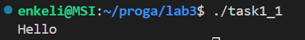
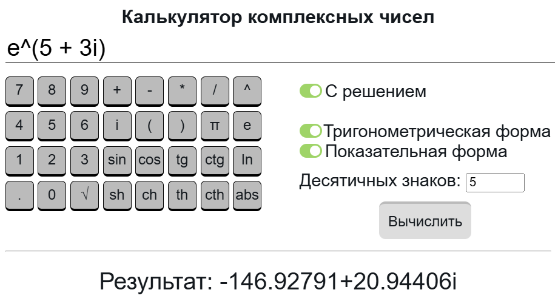
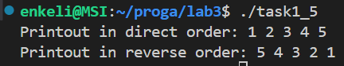
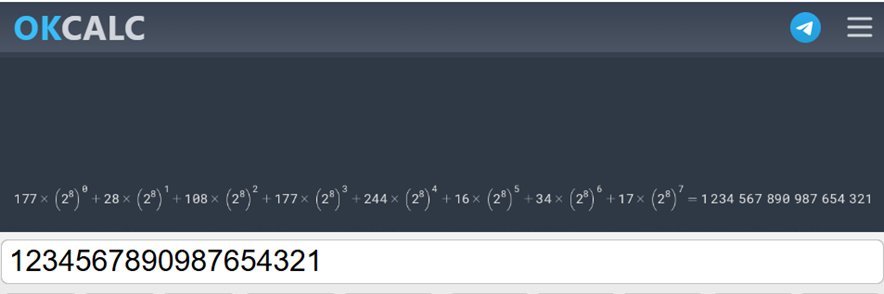

# 1. Тема лабораторной работы № 3: Структуры. Объединения. Перечисления


## Комплект 1: Структуры

### Задача 1.1

#### 1.1.2 Постановка задачи

Создать некоторую структуру с указателем на некоторую функцию в качестве поля. Вызвать эту функцию через имя переменной этой структуры и поле указателя на функцию.

#### 1.1.3 Математическая модель

нет

#### 1.1.4 Список идентификаторов

|     **Имя**      |       **Тип**       | **Описание**                                                                 |
| :----------: | :-------------: | ------------------------------------------------------------------------ |
| `printHello` |    `void ()`    | Функция, выводящая на экран сообщение `"Hello"`.                         |
|   `Struct`   |    `struct`     | Пользовательская структура, содержащая указатель на функцию.             |
|  `funcPtr`   |  `void (*)()`   | Поле структуры `Struct`, указатель на функцию без аргументов и возврата. |
|     `f`      | `struct Struct` | Переменная структуры `Struct`, через которую вызывается функция.         |

#### 1.1.5 Код программы

```c
#include <stdio.h>
#include <stdlib.h>

void printHello() {
    printf("Hello\n");
}

struct Struct
{
    void (*funcPtr)();  // указатель на функцию, не принимающую ничего и возвращающую void, то есть тоже ничего
};

int main() {
    struct Struct f;
    f.funcPtr = printHello; // записываем в поле funcPtr переменной f типа Struct адрес на функцию
    f.funcPtr();            // вызываем функцию через структуру

    return EXIT_SUCCESS;
}
```

#### 1.1.6 Результаты работы



### Задача 1.2

#### 1.2.2 Постановка задачи

Создать структуру для вектора в 3-х мерном пространстве. Реализовать и использовать в своей программе следующие операции над векторами: 
- скалярное умножение векторов; 
- векторное произведение; 
- модуль вектора; 
- распечатка вектора в консоли.

#### 1.2.3 Математическая модель

Скалярное произведение:

$$
\vec{a} \cdot \vec{b} = a_x b_x + a_y b_y + a_z b_z
$$

Векторное произведение:

$$
\vec{a} \times \vec{b} = 
\begin{vmatrix}
\vec{i} & \vec{j} & \vec{k} \\
a_x & a_y & a_z \\
b_x & b_y & b_z
\end{vmatrix} 
= \vec{i} \cdot 
\begin{vmatrix}
a_y & a_z \\
b_y & b_z
\end{vmatrix} 
- \vec{j} \cdot 
\begin{vmatrix}
a_x & a_z \\
b_x & b_z
\end{vmatrix} 
+ \vec{k} \cdot 
\begin{vmatrix}
a_x & a_y \\
b_x & b_y
\end{vmatrix}
= \vec{i} \cdot (a_y b_z - a_z b_y) 
- \vec{j} \cdot (a_x b_z - a_z b_x) 
+ \vec{k} \cdot (a_x b_y - a_y b_x)
$$

$$
\vec{a} \times \vec{b} = \left( a_y b_z - a_z b_y;\; -(a_x b_z - a_z b_x);\; a_x b_y - a_y b_x \right)
$$

Модуль вектора:

$$
|a| = \sqrt{a_x^2 + a_y^2 +a_z^2}
$$

#### 1.2.4 Список идентификаторов

|           **Имя**           |              **Тип**              | **Описание**                                                     |
| :---------------------: | :---------------------------: | ------------------------------------------------------------ |
|        `Vector`         |           `struct`            | Структура, представляющая вектор в 3-мерном пространстве     |
|      `x`, `y`, `z`      |             `int`             | Поля структуры `Vector`, координаты вектора по осям X, Y и Z |
| `scalarMultiplyVectors` | `int(Vector, Vector)` функция | Функция, возвращающая скалярное произведение двух векторов   |
| `vectorMultiplyVectors` |   `Vector(Vector)` функция    | Функция, возвращающая векторное произведение двух векторов   |
|     `vectorModule`      |   `double(Vector)` функция    | Функция, возвращающая модуль (длину) вектора                 |
|      `printVector`      |    `void(Vector)` функция     | Функция для вывода вектора                                   |
|        `a`, `b`         |           `Vector`            | Векторы, экземпляры структуры `Vector`                       |
|        `sc_prod`        |             `int`             | Результат скалярного произведения векторов `a` и `b`         |
|       `vec_prod`        |           `Vector`            | Результат векторного произведения векторов `a` и `b`         |
|    `a_mod`, `b_mod`     |           `double`            | Модули векторов `a` и `b` соответственно                     |

#### 1.2.5 Код программы

```c
#include <stdio.h>
#include <stdlib.h>
#include <math.h>

typedef struct Vector {
    int x;
    int y;
    int z;
} Vector;

int scalarMultiplyVectors(Vector, Vector);
Vector vectorMultiplyVectors(Vector, Vector);
double vectorModule(Vector);
void printVector(Vector);

int main() {
    Vector a = {1, 2, 3};
    Vector b = {4, 5, 6};
    int sc_prod = scalarMultiplyVectors(a, b);
    Vector vec_prod = vectorMultiplyVectors(a, b);
    double a_mod = vectorModule(a);
    double b_mod = vectorModule(b);

    printf("a = ");
    printVector(a);
    printf("b = ");
    printVector(b);
    printf("a • b = %d\n", sc_prod);
    printf("a × b = ");
    printVector(vec_prod);
    printf("|a| = %.3lf\n", a_mod);
    printf("|b| = %.3lf\n", b_mod);

    return EXIT_SUCCESS;
}

int scalarMultiplyVectors(Vector a, Vector b) {
    return a.x * b.x + a.y * b.y + a.z * b.z;
}

Vector vectorMultiplyVectors(Vector a, Vector b) {
    Vector res;
    res.x = a.y * b.z - a.z * b.y;
    res.y = -(a.x * b.z - a.z * b.x);
    res.z = a.x * b.y - a.y * b.x;
    return res;
}

double vectorModule(Vector a) {
    return sqrt(a.x * a.x + a.y * a.y + a.z *a.z);
}

void printVector(Vector a) {
    printf("(%d, %d, %d)\n", a.x, a.y, a.z);
}
```

#### 1.2.6 Результаты работы


### Задача 1.3

#### 1.3.2 Постановка задачи

Вычислить, используя структуру комплексного числа, комплексную экспоненту $\exp{z}$ некоторого $z \in \mathbb{C}$.

#### 1.3.3 Математическая модель

$$
\exp{z} = 1 + z + \frac{1}{2!}z^2 + \frac{1}{3!}z^3 + \dots + \frac{1}{n!}z^n
$$

$$
z = a + bi, \; i = \sqrt{-1}
$$

$$
z^n = (a + bi)(a + bi)(a + bi)\dots
$$

$$
(a + bi)(c + di) = ac + adi + bci + bdi^2 = \left[i^2 = -1 \right] = (ac - bd) + (ad + bc)i
$$

Рекуррентная формула для члена ряда:

$$
k_n = k_{n-1} \, m
$$

Множитель $m$:

$$
m = \frac{\frac{1}{n!}z^n}{\frac{1}{(n-1)!}z^{n-1}}
= \frac{\frac{z^n}{n!}}{\frac{z^{n-1}}{(n-1)!}} 
= \frac{z^n \, (n-1)!}{n! \, z^{n-1}} 
= \frac{z}{n}
$$

Тогда

$$
k_n = k_{n-1} \, \frac{z}{n} = (a + bi)\frac{c + di}{n} = \frac{(ac - bd) + (ad - bc)i}{n} = \frac{ac - bd}{n} + \frac{ad + bc}{n} i
$$

Вычисляем сумму ряда до тех, пор пока очередной член ряда не станет меньше точности $\varepsilon$:

$$
while \; (k_n < \varepsilon)
$$

#### 1.3.4 Список идентификаторов

|     **Имя**      |           **Тип**            | **Описание**                                                                              |
| :----------: | :----------------------: | ------------------------------------------------------------------------------------- |
|    `EPS`     |    `#define` (макрос)    | Точность вычислений                                                                   |
| `ComplexNum` |     `typedef struct`     | Структура комплексного числа с полями вещественной части `real` и мнимой части `imag` |
|    `real`    |         `double`         | Действительная часть комплексного числа                                               |
|    `imag`    |         `double`         | Мнимая часть комплексного числа                                                       |
| `complexExp` | `ComplexNum(ComplexNum)` | Функция, вычисляющая экспоненту от комплексного числа                                 |
|     `z`      |       `ComplexNum`       | Комплексное число, вводимое пользователем                                             |
|    `exp`     |       `ComplexNum`       | Результат вычисления, комплексная экспонента                                          |
|    `res`     |       `ComplexNum`       | Накапливающаяся внутри функции сумма                                                  |
|     `k`      |       `ComplexNum`       | Текущий член ряда                                                                     |
|     `n`      |         `double`         | Номер текущего члена ряда                                                             |
| `real_prev`  |         `double`         | Действительная часть предыдущего члена ряда                                           |
| `imag_prev`  |         `double`         | Мнимая часть предыдущего члена ряда                                                   |

#### 1.3.5 Код программы

```c
#include <stdio.h>
#include <stdlib.h>
#include <math.h>
#define EPS 10E-5

typedef struct ComplexNum
{
    double real;
    double imag;
} ComplexNum;

ComplexNum complexExp(ComplexNum);

int main() {
    ComplexNum z;
    printf("Input the real part of z: ");
    scanf("%lf", &(z.real));
    printf("Input the imaginary part of z: ");
    scanf("%lf", &(z.imag));
    
    ComplexNum exp = complexExp(z);
    printf("exp(z) = %.5lf + %.5lf*i\n", exp.real, exp.imag);

    return EXIT_SUCCESS;
}

ComplexNum complexExp(ComplexNum z) {
    ComplexNum res = {1.0, 0.0};
    ComplexNum k = z;
    double n = 1;

    while ((fabs(k.real) > EPS) || (fabs(k.imag) > EPS)) {
        res.real += k.real;
        res.imag += k.imag;
        
        double real_prev = k.real;
        double imag_prev = k.imag;
        n ++;

        k.real = (real_prev * z.real - imag_prev * z.imag) / n;
        k.imag = (real_prev * z.imag + imag_prev * z.real) / n;
    }

    return res;
}
```

#### 1.3.6 Результаты работы


Проверка:


### Задача 1.4

#### 1.4.2 Постановка задачи

Используя так называемые "битовые" поля в структуре C, создать экономную структуру в оперативной памяти для заполнения даты некоторого события, например даты рождения человека.

#### 1.4.3 Математическая модель

нет

#### 1.4.4 Список идентификаторов

| **Имя**        | **Тип**             | **Описание**                                                                  |
| :------------: | :-----------------: | ----------------------------------------------------------------------------- |
| `START_YEAR`   | `#define` (макрос)  | Константа-смещение значения года для хранения его в пределах от 1900 до 2027  |
| `BirthDate`    | `typedef struct`    | Структура, представляющая дату рождения с битовыми полями                     |
| `day`          | `unsigned int : 5`  | День месяца (1–31), хранится в 5 битах                                        |
| `month`        | `unsigned int : 4`  | Месяц (1–12), хранится в 4 битах                                              |
| `year`         | `unsigned int : 7`  | Год относительно 1900 (0–127), хранится в 7 битах                             |
| `day`          | `unsigned int`      | Переменная, значение дня рождения                                             |
| `month`        | `unsigned int`      | Переменная, значение месяца рождения                                          |
| `year`         | `unsigned int`      | Переменная, значение года рождения                                            |
| `bd`           | `BirthDate`         | Экземпляр структуры, переменная, содержащая введённую дату в компактной форме |

#### 1.4.5 Код программы

```c
#include <stdio.h>
#include <stdlib.h>
#define START_YEAR 1900 // смещение для поля year, чтобы хранить в year только года от 1900 до 2027

typedef struct BirthDate {
    unsigned int day : 5;
    unsigned int month : 4;
    unsigned int year : 7;   // чтобы структура занимала целое количество байт и не оставалось неиспользованных битов в байте
    // т. е. 5 + 4 + 7 = 16 бит = 2 байт
} BirthDate;

int main() {
    unsigned int day, month, year;
    printf("Input the day of your birth: ");
    scanf("%u", &day);
    if (!(day >= 1 && day <= 31)) {
        printf("The day value must be in the range from 1 to 31!\n");
        return EXIT_FAILURE;
    }
    printf("Input the month of your birth: ");
    scanf("%u", &month);
    if (!(month >= 1 && month <= 12)) {
        printf("The month value must be in the range from 1 to 12!\n");
        return EXIT_FAILURE;
    }
    printf("Input the year of your birth: ");
    scanf("%u", &year);
    if (!(year >= 1900 && year <= 2027)) {
        printf("The year value must be in the range from 1900 to 2027!\n");
        return EXIT_FAILURE;
    }

    BirthDate bd = {day, month, year - START_YEAR};
    printf("Your birthdate: %d.%d.%d\n", bd.day, bd.month, bd.year + START_YEAR);
    printf("sizeof(BirthDate): %lu\n", sizeof(BirthDate));

    return EXIT_SUCCESS;
}
```

#### 1.4.6 Результаты работы


### Задача 1.5

#### 1.5.2 Постановка задачи

Реализовать в виде структур двунаправленный связный список и совершить отдельно его обход в прямом и обратном направлениях с распечаткой значений каждого элемента списка.

#### 1.5.3 Математическая модель

нет

#### 1.5.4 Список идентификаторов

| **Идентификатор**  | **Тип**                 | **Описание**                                                                           |
| :------------: | :-----------------: | ----------------------------------------------------------------------------------------------- |
| `Node`         | `struct`            | Структура, представляющая узел двусвязного списка                                               |
| `data`         | `int`               | Поле структуры, значение элемента списка                                                        |
| `next`         | `struct Node*`      | Поле структуры, указатель на следующий элемент                                                  |
| `prev`         | `struct Node*`      | Поле структуры, указатель на предыдущий элемент                                                 |
| `append`       | `void(Node**, int)` | Пользовательская функция, добавляет элемент в конец списка                                      |
| `directPrint`  | `void(Node*)`       | Пользовательская функция, печатает список в прямом порядке                                      |
| `reversePrint` | `void(Node*)`       | Пользовательская функция, печатает список в обратном порядке                                    |
| `freeList`     | `void(Node*)`       | Пользовательская функция, освобождает динамическую память, выделенную под каждый элемент списка |
| `head`         | `Node*`             | Указатель на первый элемент списка, используется и в `main()` и как параметр функций            |
| `new_node`     | `Node*`             | Новый добавляемый узел, используется в `append()`                                               |
| `last`         | `Node*`             | Указатель на последний узел списка, используется в `append()`                                   |
| `new_data`     | `int`               | Значение для нового добавляемого узла, используется в `append()`                                |
| `pointer`      | `Node*`             | Указатель для обхода списка, используется в `directPrint`, `reversePrint`, `freeList`           |

#### 1.5.5 Код программы

```c
#include <stdio.h>
#include <stdlib.h>

typedef struct Node {
    int data;
    struct Node *next;
    struct Node *prev;
} Node;

void append(Node **head, int new_data);
void directPrint(Node *head);
void reversePrint(Node *head);
void freeList(Node *head);


int main() {
    Node *head = NULL;

    append(&head, 1);
    append(&head, 2);
    append(&head, 3);
    append(&head, 4);
    append(&head, 5);

    directPrint(head);
    reversePrint(head);

    freeList(head);

    return EXIT_SUCCESS;
}

void append(Node** head, int new_data) {
    Node *new_node = (Node*)malloc(sizeof(Node));
    new_node->data = new_data;
    new_node->next = NULL;

    if (*head == NULL) {
        *head = new_node;
        new_node->prev = NULL;
        return;
    }

    Node *last = *head;
    while (last->next != NULL) {
        last = last->next;
    }
    
    last->next = new_node;
    new_node->prev = last;
}

void directPrint(Node *head) {
    Node *pointer = head;
    printf("Printout in direct order: ");
    while (pointer != NULL) {
        printf("%d ", pointer->data);
        pointer = pointer->next;
    }
    printf("\n");
}

void reversePrint(Node *head) {
    if (head == NULL) return;

    Node *pointer = head;
    while (pointer->next != NULL) {
        pointer = pointer->next;
    }

    printf("Printout in reverse order: ");
    while (pointer != NULL) {
        printf("%d ", pointer->data);
        pointer = pointer->prev;
    }
    printf("\n");
}

void freeList(Node *head) {
    Node *pointer;
    while (pointer != NULL) {
        pointer = head;
        head = head->next;
        free(pointer);
    }
}
```

#### 1.5.6 Результаты работы



## Комплект 2: Объединения и перечисления

### Задача 2.1

#### 2.1.2 Постановка задачи

Напишите программу, которая использует указатель на некоторое объединение `union`.

#### 2.1.3 Математическая модель

нет

#### 2.1.4 Список идентификаторов

| **Идентификатор** |     **Тип**      | **Описание**                                                   |
| :---------------: | :--------------: | :------------------------------------------------------------- |
|     `MyUnion`     |     `union`      | Объединение, содержащее целочисленное и вещественное значение  |
|        `i`        |      `int`       | Поле объединения `MyUnion`, хранит целое значение              |
|        `f`        |     `float`      | Поле объединения `MyUnion`, хранит значение с плавающей точкой |
|        `u`        | `union MyUnion*` | Указатель на объединение                                       |

#### 2.1.5 Код программы

```c
#include <stdio.h>
#include <stdlib.h>

union MyUnion {
    int i;
    float f;
};

int main() {
    union MyUnion *u;

    u->i = 5;
    printf("int: %d\n", u->i);
    u->f = 3.5;
    printf("float: %f\n", u->f);

    return EXIT_SUCCESS;
}
```

#### 2.1.6 Результаты работы


### Задача 2.2

#### 2.2.2 Постановка задачи

Напишите программу, которая использует `union` для побайтовой распечатки типа `unsigned long`.

#### 2.2.3 Математическая модель

$$
1234567890987654321 = 177 * (2^8)^0 + 28 * (2^8)^1 + 108 * (2^8)^2 + 177 * (2^8)^3 + 244 * (2^8)^4 + 16 * (2^8)^5 + 34 * (2^8)^6 + 17 * (2^8)^7
$$

#### 2.2.4 Список идентификаторов

| **Идентификатор** |      **Тип**       | **Описание**                                                                |
| :---------------: | :----------------: | --------------------------------------------------------------------------- |
|     `number`      |      `union`       | Объединение, содержащее `unsigned long` и массив `unsigned char`            |
|        `n`        |  `unsigned long`   | Поле объединения `number`, хранит значение в виде беззнакового целого числа |
|        `b`        | `unsigned char[N]` | Поле объединения `number`, хранит то же значение, но побайтово              |
|        `N`        |      `macro`       | Макрос, константа, в которой хранится размер типа `unsigned long`           |
|       `num`       |   `union number`   | Переменная, экземпляр объединения `number`                                  |
|        `i`        |       `int`        | Параметр цикла, используемый для побайтового вывода `number`                |

#### 2.2.5 Код программы

```c
#include <stdio.h>
#include <stdlib.h>
#define N sizeof(unsigned long)

union number {
    unsigned long n;
    unsigned char b[N];
};

int main() {
    union number num;
    num.n = 7927;

    printf("num = %lu\n", num.n);
    printf("num byte-by-byte: |");
    for (int i = 0; i < N; i++) {
        printf("%3d|", num.b[i]);
    }
    printf("\n");

    return EXIT_SUCCESS;
}
```

#### 2.2.6 Результаты работы


Проверка:



### Задача 2.3

#### 2.3.2 Постановка задачи

Создайте перечислимый тип данных (`enum`) для семи дней недели и распечатайте на экране его значения, как целые числа.

#### 2.3.3 Математическая модель

нет

#### 2.3.4 Список идентификаторов

|          **Идентификатор**          | **Тип** | **Описание**                                                                                                                    |
| :---------------------------------: | :-----: | ------------------------------------------------------------------------------------------------------------------------------- |
|             `Weekdays`              | `enum`  | Перечисление, представляющее дни недели                                                                                         |
| `Sunday`, `Monday`, ..., `Saturday` |  `int`  | Экземпляры перечисления `Weekdays`, константы, дни недели, изменяющиеся от `Sunday` (значение `0`) до `Saturday` (значение `6`) |

#### 2.3.5 Код программы

```c
#include <stdio.h>
#include <stdlib.h>

enum Weekdays {
    Sunday, Monday, Tuesday, Wednesday, Thursday, Friday, Saturday
};

int main() {
    printf("Sunday: %d\n", Sunday);
    printf("Monday: %d\n", Monday);
    printf("Tuesday: %d\n", Tuesday);
    printf("Wednesday: %d\n", Wednesday);
    printf("Thursday: %d\n", Thursday);
    printf("Friday: %d\n", Friday);
    printf("Saturday: %d\n", Saturday);

    return EXIT_SUCCESS;
}
```

#### 2.3.6 Результаты работы


### Задача 2.4

#### 2.4.2 Постановка задачи

Создайте так называемое *размеченное объединение* `union`, которое заключено в виде поля структуры `struct` вместе с ещё одним полем, которое является перечислением `enum` и служит индикатором того, что именно на текущий момент хранится в таком вложенном объединении. Создать и заполнить динамический массив таких структур с объединениями внутри, заполняя вспомогательное поле перечисления `enum` для сохранения информации о хранимом в каждом размеченном объединении типе данных. Реализовать распечатку данных массива таких структур в консоль.

#### 2.4.3 Математическая модель

нет

#### 2.4.4 Список идентификаторов

| Идентификатор |       Тип       | Описание                                                                                         |
| :-----------: | :-------------: | ------------------------------------------------------------------------------------------------ |
|     `LEN`     |    `#define`    | Макрос, задающий размер массива (5).                                                             |
|    `Data`     |     `union`     | Объединение, которое может содержать одно из следующих значений: `int`, `float`, или `char`.     |
|      `i`      |      `int`      | Поле объединения `Data`, которое хранит целое число.                                             |
|      `f`      |     `float`     | Поле объединения `Data`, которое хранит число с плавающей точкой.                                |
|      `c`      |     `char`      | Поле объединения `Data`, которое хранит символ.                                                  |
|  `DataType`   |     `enum`      | Перечисление, которое задает тип данных: `INT`, `FLOAT`, или `CHAR`.                             |
|     `INT`     |     `enum`      | Элемент перечисления `DataType`, обозначающий целое число.                                       |
|    `FLOAT`    |     `enum`      | Элемент перечисления `DataType`, обозначающий число с плавающей точкой.                          |
|    `CHAR`     |     `enum`      | Элемент перечисления `DataType`, обозначающий символ.                                            |
|  `MyStruct`   |    `struct`     | Структура, содержащая поле объединения `data` и перечисление `type`.                             |
|    `data`     |  `union Data`   | Поле структуры `MyStruct`, которое хранит одно из значений объединения `Data`.                   |
|    `type`     | `enum DataType` | Поле структуры `MyStruct`, которое хранит тип данных из перечисления `DataType`.                 |
| `inputArray`  |   `function`    | Функция для ввода значений в массив структуры `MyStruct`.                                        |
| `printArray`  |   `function`    | Функция для вывода содержимого массива структур `MyStruct`.                                      |
|    `array`    |   `MyStruct*`   | Указатель на массив структур `MyStruct`.                                                         |
|      `i`      |      `int`      | Параметр цикла, индекс текущего элемента в массиве `array`.                                      |
|      `t`      |      `int`      | Переменная для хранения типа элемента, который будет введен.                                     |
|    `value`    |     `float`     | Вспомогательная переменная для ввода значения, которое проверяется на соответствие целому числу. |

#### 2.4.5 Код программы

```c
#include <stdio.h>
#include <stdlib.h>
#define LEN 5

union Data {
    int i;
    float f;
    char c;
};

enum DataType {
    INT, FLOAT, CHAR
};

typedef struct MyStruct {
    union Data data;
    enum DataType type;
} MyStruct;

MyStruct inputArray(MyStruct *array);
void printArray(MyStruct *array);

int main() {
    MyStruct *array = (MyStruct*)malloc(LEN * sizeof(MyStruct));
    if (array == NULL) {
        fprintf(stderr, "Memory allocation failed\n");
        return EXIT_FAILURE;
    }

    inputArray(array);
    printArray(array);

    free(array);    

    return EXIT_SUCCESS;
}

MyStruct inputArray(MyStruct *array) {
    printf("If you want the element to be int, press '1', float - press '2', char - press '3'\n");
    for (int i = 0; i < LEN; i++) {
        int t;
        printf("Element #%d:\n", i + 1);
        printf("\tInput element type (1, 2, 3): ");
        while (scanf("%d", &t) != 1 || (t != 1 && t != 2 && t != 3)) {
            printf("\tInvalid element type! Input '1', '2', or '3' (1 - int, 2 - float, 3 - char): ");
            while (getchar() != '\n');  // очистка буфера ввода для корректного следующего считывания
        }

        while (getchar() != '\n');  // очистка буфера ввода для корректного следующего считывания

        switch (t) {
        case 1:
            array[i].type = INT;
            float value;
            printf("\tInput the element value: ");
            // проверка того, записалось ли что-то в value и точно ли value является целым числом
            while (scanf("%f", &value) != 1 || value - (int)value != 0) {
                printf("\tWrong value! Input the integer: ");
                while (getchar() != '\n');
            }
            while (getchar() != '\n');

            // когда в value наконец-то записано именно целое число, а не дробное или другой символ,
            // то передаем в поле data значение value
            array[i].data.i = (int)value;
            break;
        case 2:
            array[i].type = FLOAT;
            printf("\tInput the element value: ");
            // проверка того, записалось ли в поле data число
            while (scanf("%f", &array[i].data.f) != 1) {
                printf("\tWrong value! Input the float: ");
                while (getchar() != '\n');
            }
            while (getchar() != '\n');
            break;
        case 3:
            array[i].type = CHAR;
            printf("\tInput the element value: ");
            // проверка, чтобы в поле data не записался символ переноса строки
            // (в таком случае ввод просто будет пропущен),
            // оставшийся из прошлого scanf()
            while (scanf("%c", &array[i].data.c) != 1) {
                printf("\tWrong value! Input the valid char: ");
                while (getchar() != '\n');
            }
            while (getchar() != '\n');
            break;
        }
    }
}

void printArray(MyStruct *array) {
    printf("\nArray printout:\n");
    for (int i = 0; i < LEN; i++) {
        switch (array[i].type) {
        case INT:
            printf("%d. data: %d, type: INT\n", i+1, array[i].data.i);
            break;
        case FLOAT:
            printf("%d. data: %.3f, type: FLOAT\n", i+1, array[i].data.f);
            break;
        case CHAR:
            printf("%d. data: %c, type: CHAR\n", i+1, array[i].data.c);
            break;
        }
    }
}
```

#### 2.4.6 Результаты работы


# 7. Трофимцова Екатерина, 1 курс, группа ИВТ-1, подгруппа 2